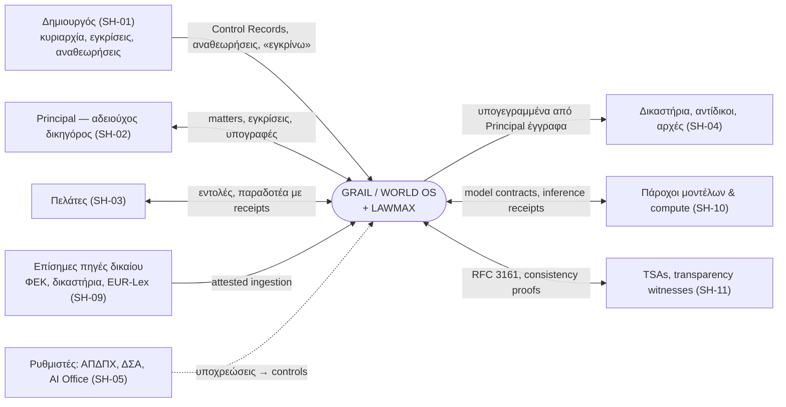
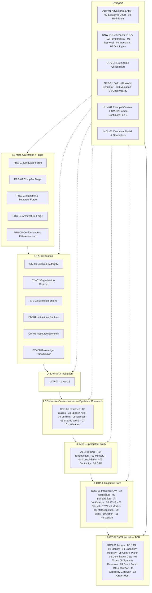
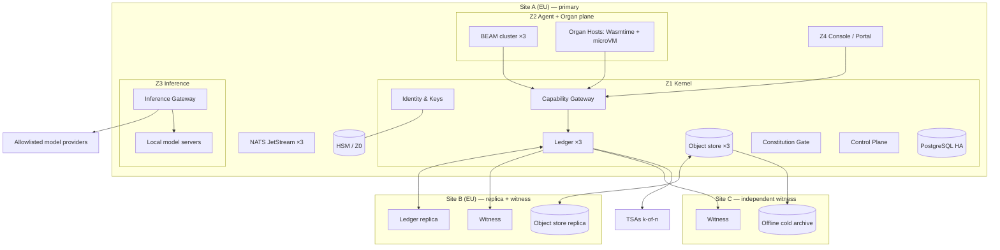
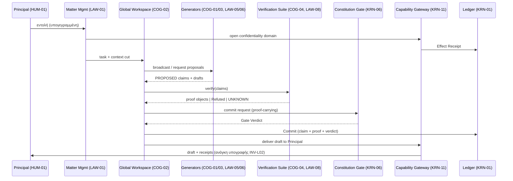
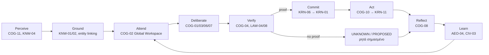
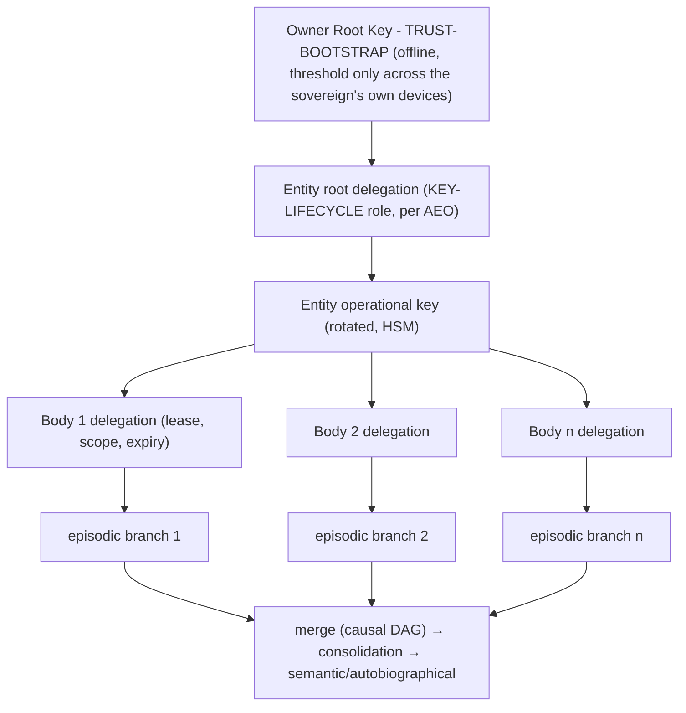
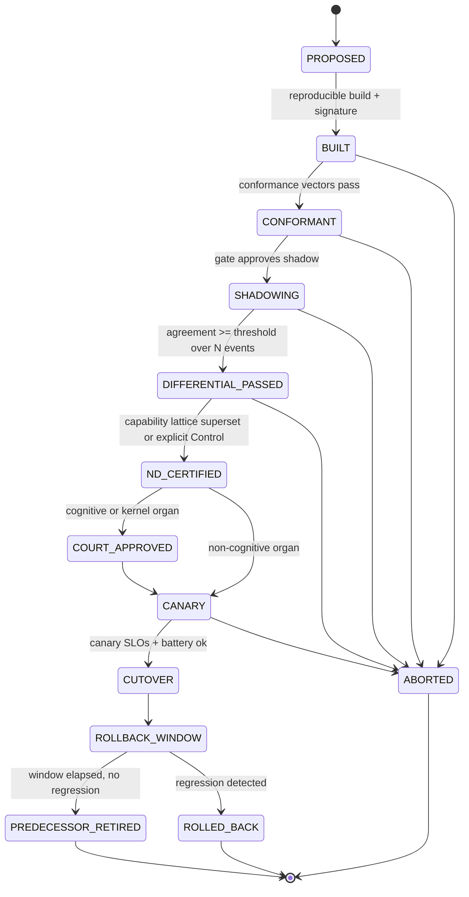

# GRAIL / WORLD OS — MASTER ARCHITECTURE DEFINITION PACKAGE
## v1.0 — Canonical Design Baseline

Copyright (c) 2026 STAVROPOULOS LAW. All Rights Reserved. Ιδιόκτητο — βλ. `LICENSE` στη ρίζα του repository.

---

### Έλεγχος εγγράφου

| Πεδίο | Τιμή |
|---|---|
| Έκδοση | 1.0 |
| Ημερομηνία | 2026-09-15 |
| Κατάσταση | **PROPOSED — design baseline.** Καμία υλοποίηση χωρίς ρητό «εγκρίνω GP-n» του δημιουργού. Το πακέτο **δεν** αλλάζει την κλειδωμένη σειρά LAWMAX του `deployment/collab/STATE-OF-PLAY.md`. |
| Έδρα εγγράφου | `deployment/grail/GRAIL_WORLD_OS_MASTER_ARCHITECTURE_v1.0.md` — κάτω από τον ήδη υπάρχοντα φάκελο των target specs· κανένας νέος top-level φάκελος (κανόνας `:no-new-top-level`, `deployment/LAWMAX-ARCHITECTURE-CONSTITUTION.sexp`). Όλες οι σχετικές διαδρομές του πακέτου (`model/`, `formal/`, `contracts/` …) είναι ως προς τη ρίζα `deployment/grail/`. |
| Canonical model | `model/grail-world-os.sysml` + `model/grail-world-os.kerml` |
| Θέση στο canon | **Crosswalk + πρόταση συνταγματικής τροποποίησης — όχι νέος παράλληλος στόχος.** Κάθε έννοια του GRAIL αντιστοιχίζεται σε ένα από τα 13 κλειδωμένα primitives και επεκτείνει υπάρχουσα έδρα (§0.3, §3.1, §6.4). Το LAWMAX-Ω / CPEI (`deployment/LAWMAX-CPEI-TARGET-SPEC.md`) παραμένει η έδρα-στόχος του στρώματος LAWMAX· το Ω+ plan ([0018]) παραμένει το μοναδικό execution roadmap· οι φάσεις GP-n είναι μόνο προτάσεις ένταξης στην κλειδωμένη σειρά του δημιουργού (ADR-0032). |
| Κλάδος εργασίας | Το checked-out branch υστερεί του `origin/main` (420 commits, χωρίς κοινό πρόγονο). Το πακέτο είναι αυτοτελές και μεταφέρεται αυτούσιο· η κατάθεση στον διάλογο γίνεται μόνο στη γραμμή του δημιουργού (Παράρτημα Ω). |
| Προτεραιότητα εδρών | (1) το canonical model, **από τη στιγμή που περνά το gate του GP-0** (`archgen --check`)· (2) οι πίνακες-μητρώα αυτού του εγγράφου (προβολές του model)· (3) τα λεπτομερή έγγραφα (`verification/KILL-TESTS.md`, `adrs/`, `contracts/`, `formal/`) που **εξειδικεύουν** αλλά δεν αλλάζουν IDs, υποθέσεις ή κριτήρια αποδοχής. Κάθε ασυμφωνία = σφάλμα gate, όχι θέμα ερμηνείας. |
| Γλώσσα | Ελληνική πρόζα με αγγλική τεχνική ορολογία· τα machine artifacts (model, contracts, formal, ADRs) στα αγγλικά. |
| Ρόλοι μοντέλων | Κανένα όνομα/ID μοντέλου σε artifacts του repo (μόνιμος νόμος). Οι ρόλοι (Generative Architect, Adversarial Critic, Judge Simulator …) δεσμεύονται σε συγκεκριμένα μοντέλα **μόνο** μέσω configuration του Inference Gateway (CMP-COG-01). Αυτό είναι ταυτόχρονα η αρχή 5 (καμία εξάρτηση από LLM). |

### Υπόμνημα κατάστασης (εφαρμόζεται σε κάθε στοιχείο του πακέτου)

- **[T] Today** — υλοποιήσιμο σήμερα με αποδεδειγμένη τεχνολογία· μπαίνει σε GP-φάση με κριτήρια εξόδου.
- **[X] Experiment** — απαιτεί πείραμα `EXP-nn` με προκαθορισμένο κριτήριο θανάτου πριν δεσμευτεί η σχεδίαση.
- **[E] Extension point** — σταθερό συμβόλαιο ορισμένο **σήμερα**, υλοποίηση όταν ωριμάσει η τεχνολογία (`EP-nn`).

### Συμβάσεις αναγνωριστικών

`T0–T9` Telos · `REQ-<AREA>-nnn` απαιτήσεις · `F-n.n` λειτουργίες · `CMP-<LAYER>-nn` components · `ICD-nn` interfaces · `INV-<C>nn` invariants · `VT-nnn` verification tests · `KT-nn` kill tests · `EXP-nn` πειράματα · `ADR-nnnn` αποφάσεις · `EP-nn` extension points · `GP-n` φάσεις προγράμματος (διακριτές από τις Φ-φάσεις του LAWMAX) · `M-n` βήματα μετάβασης · `OS-nn` σενάρια · `SH-nn` stakeholders · `WP-nn` work packages · `EV-*` evidence artifacts.

Areas: `KRN` kernel · `COG` cognition · `MEM` memory · `IDN` identity · `CCP` collective · `LIF` lifecycle · `LAW` LAWMAX · `ADV` adversarial/court · `KNW` knowledge/evidence · `FRG` forge · `EVO` evolution · `SEC` security/fault · `GOV` constitution/controls · `INT` contracts/integration · `ABS` absorption · `VAL` evaluation · `OPS` operations · `HUM` human interface · `MDL` canonical model/design platform.

### Χάρτης παραδοτέων (εντολή §6, 1–30 → ενότητες → machine artifacts)

| # | Παραδοτέο | Ενότητα | Machine artifact |
|---|---|---|---|
| 1 | Mission & Telos | §1 | `model/…sysml` pkg `Telos` |
| 2 | Scope & boundaries | §2 | pkg `OperationalAnalysis` |
| 3 | Canonical terminology | §3 | `model/…kerml` (semantic kernel) |
| 4 | Stakeholders & operational scenarios | §4 | pkg `OperationalAnalysis` |
| 5 | Functional decomposition | §5 | pkg `FunctionalAnalysis` |
| 6 | Logical architecture | §6 | pkg `LogicalArchitecture`, `architecture/workspace.dsl` |
| 7 | Runtime & deployment | §7 | pkg `PhysicalArchitecture`, `architecture/workspace.dsl` |
| 8 | Cognitive architecture | §8 | pkg `LogicalArchitecture::Cognition` |
| 9 | Memory & identity | §9 | `formal/tla/IdentityContinuity.tla`, `formal/lean/` |
| 10 | Collective-consciousness protocol | §10 | `formal/tla/EpistemicCommons.tla`, `contracts/asyncapi/` |
| 11 | Birth/lineage/evolution/retirement | §11 | `formal/alloy/Lineage.als` |
| 12 | LAWMAX institutional architecture | §12 | `contracts/openapi/lawmax-matter.yaml` |
| 13 | Adversarial Entity & Epistemic Court | §13 | `formal/tla/EpistemicCourt.tla` |
| 14 | Knowledge, evidence & provenance | §14 | `formal/alloy/Provenance.als`, `contracts/openapi/evidence.yaml` |
| 15 | Interface Control Documents | §15 | pkg `Interfaces`, `contracts/proto/` |
| 16 | Data, event & API contracts | §16 | `contracts/` |
| 17 | Language & substrate forge | §17 | pkg `LogicalArchitecture::Forge` |
| 18 | Security, fault, Byzantine, recovery | §18 | `formal/tla/*`, `verification/KILL-TESTS.md` |
| 19 | Executable Constitution & invariants | §19 | pkg `Constitution`, `formal/lean/`, `formal/alloy/` |
| 20 | Technology-to-component mapping | §20 | `architecture/workspace.dsl` (technology tags) |
| 21 | Build-versus-buy | §21 | `adrs/` |
| 22 | ADR register | §22 | `adrs/ADR-*.md` |
| 23 | V&V matrix | §23 + §29 | `verification/VV-MATRIX.md` (generated) |
| 24 | Kill-test catalogue | §24 | `verification/KILL-TESTS.md` |
| 25 | Implementation dependency graph | §25 | `implementation/DEPENDENCY-GRAPH.md` |
| 26 | Phased experimental programme | §26 | `implementation/DEPENDENCY-GRAPH.md` |
| 27 | Migration path | §27 | — |
| 28 | 2040 absorption mechanism | §28 | pkg `ExtensionPoints` |
| 29 | Traceability matrix | §29 | `verification/TRACEABILITY-MATRIX.md` (generated) |
| 30 | Αυτόματη παραγωγή μελέτης/διαγραμμάτων | §30 | `tools/archgen/` |
| — | (Νέο ερώτημα δημιουργού) Ανώτερη πλατφόρμα σχεδιασμού | §31 | ADR-0028 |
| — | Continuation checkpoint | Παράρτημα Ω | — |

---

## 0. Η ΜΙΑ ΙΔΕΑ — αρχιτεκτονική θέση του πακέτου

**Θέση.** Η ταυτότητα, η αλήθεια και η εξουσία του συστήματος ζουν σε έναν **ελάχιστο, αποδείξιμο πυρήνα τριών ουσιών**:

1. **Γεγονότα** — υπογεγραμμένα, content-addressed, append-only, διτεμπορικά (valid / recorded / known-at) και αιτιακά διατεταγμένα.
2. **Δεσμεύσεις (commitments)** — Merkle ρίζες πάνω σε μνήμη, γνώση, σύνταγμα, μητρώο ικανοτήτων.
3. **Κατηγορήματα** — εκτελέσιμα συνταγματικά κατηγορήματα που κάθε μετάβαση κατάστασης πρέπει να ικανοποιεί.

**Όλα τα υπόλοιπα — μοντέλα, γλώσσες, βάσεις δεδομένων, runtimes, πάροχοι, ακόμη και η υλοποίηση του ίδιου του πυρήνα — είναι όργανα (organs):** αντικαταστάσιμα, επαληθεύσιμα έναντι conformance vectors, με υπογεγραμμένη καταγραφή κάθε μετάβασης.

Από αυτή τη μία θέση **παράγονται** (δεν προστίθενται) οι απαιτήσεις του οράματος:

| Απαίτηση του οράματος | Πώς παράγεται δομικά από τη θέση |
|---|---|
| Αντικατάσταση οργάνων χωρίς απώλεια ταυτότητας/μνήμης | Η ταυτότητα δεν εδράζεται ποτέ σε όργανο· όργανο που αλλάζει δεν αγγίζει γεγονότα/δεσμεύσεις (INV-O01). |
| Μία ταυτότητα, πολλά σώματα | Σώμα = εξουσιοδοτημένος εκτελεστής με delegated κλειδί· η ιστορία του είναι κλάδος του ίδιου ledger DAG (INV-I04). |
| Συλλογική συνείδηση χωρίς χάος | Η έμπιστη κατάσταση αλλάζει μόνο με τυποποιημένες, επαληθευμένες πράξεις λόγου· δεν υπάρχει μονοπάτι ελεύθερου κειμένου προς αυτήν (INV-K05). |
| Ατομικότητα μέσα στο συλλογικό | Stance ανά οντότητα, ιδιωτική μνήμη, διατήρηση διαφωνίας (INV-K03, INV-K04). |
| Συνεχής εξέλιξη χωρίς υποβάθμιση | Μονότονο μητρώο ικανοτήτων· μετάβαση χωρίς απόδειξη Non-Diminution **δεν είναι αναπαραστάσιμη** (INV-C01). |
| Εξωτερικοί, εμφανείς, αναστρέψιμοι περιορισμοί | Control = εγγραφή ledger· επιβολή μόνο στο Capability Gateway· η γνωσιακή ικανότητα μένει ανέπαφη (INV-C02). |
| Τίμια άγνοια / κανένα LLM στο trusted path | Κύκλος Propose–Verify–Commit: οι γεννήτριες προτείνουν, μόνο οι verifiers δεσμεύουν· `UNKNOWN` = πρώτης τάξης τύπος απάντησης (INV-C03, INV-C04). |
| Απορρόφηση τεχνολογίας 2040+ | Ο πυρήνας γνωρίζει μόνο: γεγονότα, content addresses, algorithm-tagged κλειδιά, capabilities, controls, κατηγορήματα, χρόνο. Νέα τεχνολογία = νέο όργανο ή adapter, ποτέ νέος πυρήνας (§28). |
| Αντιπαλική αλήθεια | Το Epistemic Court είναι το **μόνο** μονοπάτι προς το επίπεδο ετυμηγοριών (INV-K02). |

### 0.1 Εξάλειψη κλάσεων σφάλματος (όχι φρουροί)

Κατά τον Υπέρτατο Νόμο («φρουρός γύρω από λάθος σχήμα < εξάλειψη της κλάσης σφάλματος»), κάθε κλασική αστοχία αυτής της κατηγορίας συστημάτων αντιστοιχίζεται στη δομή που την κάνει **μη αναπαραστάσιμη**:

| Κλάση σφάλματος | Δομή που την εξαλείφει | Invariant |
|---|---|---|
| Απώλεια ταυτότητας σε migration | Ταυτότητα = ledger + δεσμεύσεις· migration = replay + consistency proof | INV-I01, INV-I02 |
| Σιωπηλή απώλεια ικανότητας | Ο τύπος `TransitionRecord` απαιτεί πεδίο ND-evidence **ή** αναφορά σε Control Record — τρίτη μορφή δεν υπάρχει | INV-C01 |
| Hallucination σε έμπιστη κατάσταση | Το `Commit` API δέχεται μόνο `ProofCarryingClaim` (type-level) | INV-C03 |
| Χαοτικό group chat | Κανένα write path ελεύθερου κειμένου προς trusted state· μόνο typed speech acts | INV-K05 |
| Vendor lock-in | Ο πυρήνας περιέχει μόνο συμβόλαια· κάθε vendor πίσω από adapter με conformance vectors | INV-O02 |
| Vector index ως πηγή αλήθειας | Indexes = παράγωγα, επαναϋπολογίσιμα· η διαγραφή τους είναι kill test | INV-E01 |
| Επανεγγραφή ιστορίας σε rollback | Rollback = νέο forward (compensating) γεγονός | INV-G02 |
| Διάχυση δηλητηριασμένης μαρτυρίας | PROV-DAG + ATMS labels ⇒ η μόλυνση είναι διάσχιση γράφου, όχι ευρετική | INV-E02 |
| Κρυφοί περιορισμοί | Control = εγγραφή ledger· το gateway επιβάλλει μόνο ό,τι είναι καταγεγραμμένο | INV-C02 |
| Εξέλιξη που τροποποιεί τους κριτές της | Constitution, verifier set και constitution gate εκτός χώρου αναζήτησης | INV-F02 |
| Επίθεση εντολών μέσω περιεχομένου (prompt injection) | Κανάλια με provenance-tag: περιεχόμενο παρατήρησης δεν γίνεται ποτέ εντολή | INV-S01 |

### 0.2 Σχεδιασμός δύο κατευθύνσεων (αρχή 10)

- **Reverse από το Telos — αρχή μη-αποκλεισμού (non-foreclosure):** για κάθε Telos T1–T9 ρωτάμε «ποια ιδιότητα του πυρήνα, αν έλειπε, θα απέκλειε για πάντα αυτό το Telos;». Οι απαντήσεις είναι ακριβώς τα kernel contracts ICD-01…ICD-12 και τα Tier-0 invariants.
- **Forward από τις σημερινές αποδεδειγμένες δυνατότητες — αρχή υλοποιησιμότητας:** κάθε kernel contract πρέπει να υλοποιείται σήμερα με ώριμη τεχνολογία ([T]).
- **Σημείο συνάντησης = τα kernel contracts.** Επιχείρημα επάρκειας πυρήνα: ο πυρήνας είναι *ελάχιστος* ώστε να χτίζεται τώρα και *επαρκής* ώστε να μη χρειαστεί επανασχεδιασμό. Όπου το Telos απαιτεί κάτι που δεν υπάρχει σήμερα, δεν μπαίνει στον πυρήνα· μπαίνει ως [E] extension point με συμβόλαιο σήμερα.

### 0.3 Θέση στο υπάρχον canon — το GRAIL ως crosswalk (όχι τέταρτος στόχος)

Το repository έχει ήδη δηλωμένη ιεραρχία κειμένων: **CPEI-TARGET-SPEC = ο στόχος** του νομικού θεσμού (12 στρώματα, InstitutionalAct 18 πεδίων), **OMEGA-PLAN = ο δρόμος**, **MEMORY-KERNEL-SPEC = η έδρα μνήμης**, **LAWMAX-ARCHITECTURE-CONSTITUTION.sexp + `--architecture-constitution-gate` = το μόνο επιβαλλόμενο παρόν**, **[0018] Ω+ plan = το μοναδικό execution roadmap**. Το προηγούμενο του `LAWMAX-CEILING-CROSSWALK` ορίζει τη νόμιμη μορφή για ένα ευρύτερο όραμα: **crosswalk πάνω στις υπάρχουσες έδρες**, όχι νέος στόχος δίπλα τους.

Το GRAIL γράφεται ακριβώς έτσι. Η εντολή του δημιουργού (2026-09-15) τοποθετεί το LAWMAX-Ω ως **πρώτη θεσμική έκφραση** μέσα σε μια ευρύτερη ιεραρχία (World OS → GRAIL → AEO → Collective → LAWMAX-Ω → Civilization → Meta). Το GRAIL:

1. **Δεν προσθέτει κανένα νέο primitive.** Κάθε στρώμα αντιστοιχίζεται στα 13 κλειδωμένα primitives του συντάγματος:

| Στρώμα GRAIL | Primitives | Υπάρχουσες έδρες που επεκτείνει |
|---|---|---|
| WORLD OS kernel | `:substrate` `:memory` `:authority` `:proof` | `source/journal.lisp` (Persistence Receipt), `source/merkle-authority.lisp`, `transparency-log.lisp`, `source/canonical-representation.lisp` (JCS), `source/paths.lisp` (institution-root), `source/deterministic-time.lisp`, `source/constitutional-gate.lisp` + `constitutional-dispatch.lisp`, `source/capability-registry.lisp`, Docker αποδεικτική αλυσίδα, `LAWMAX-NIXOS-COGNITIVE-SUBSTRATE.md` (Nix = σώμα, όχι γνώση) |
| GRAIL cognitive | `:hypothesis` `:argument` `:proof` `:fact` `:output-trust` | `source/cognition.lisp` (5 στάδια, μη έμπιστη θέση advisor), `source/deliberation.lisp`, `source/legal-inference-engine.lisp` (WFS/JTMS), `ΧΑΡΤΗΣ-ΝΟΗΣΗΣ` Σ4–Σ12, η μία πόρτα LLM `load-proposal-file!` (`source/what-if.lisp`) |
| AEO | `:self` `:memory` | `deployment/SYSTEM-CONSTITUTION.sexp` + `source/self-constitution.lisp`, `source/self-history.lisp`, `source/self-model.lisp`, `component-manifest.sexp`, `LAWMAX-MEMORY-KERNEL-SPEC`, `source/memory.lisp`, μοντέλο `LAWMAX_REPLICA` (ένας συγγραφέας) |
| Collective Consciousness | `:argument` `:fact` `:institution` | `source/legal-dialectic.lisp` (grounded semantics), N-minds protocol + plurality doctrine του `LAWMAX-CEILING-CROSSWALK`, `source/institution.lisp` |
| LAWMAX-Ω | `:law` `:matter` `:authority` `:institution` `:output-trust` | CPEI L1–L12 στο σύνολό τους· `source/version-graph.lisp`, `source/legal-identity.lisp`, `source/legal-authority-receipt.lisp`, `source/proof-carrying.lisp`, GAAF-1 ([0090]) |
| AI Civilization | `:institution` `:evolution` | `source/institution.lisp` (`declare-institution!`, `declare-role!`), `orchestrator.adoption:can-adopt`, `LAWMAX-AUTODIDACTIC-LOOP` |
| Meta-Civilization / Forge | `:evolution` `:substrate` | `understanding-learning.lisp`, `self-extension.lisp`, `what-if`/adoption, NixOS substrate |
| Adversarial Entity & Epistemic Court | `:argument` `:proof` `:institution` | [0047] + [0093] (8 βήματα, όροι ανεξαρτησίας i–iv), CPEI L6 (`legal-dialectic`, `case-workspace`), Ω+3 «proof obligations, όχι personas», `deployment/verify` (N-version + vectors), `--external-benchmark-gate` |
| Knowledge / Evidence | `:fact` `:authority` `:proof` | `version-graph`, receipts, `slw-source-prov/1` sidecars, `corpus-provenance`, merkle, tlog |
| Governance / Constitution | `:institution` `:self` | ARCHITECTURE-CONSTITUTION (νόμος repo) + SYSTEM-CONSTITUTION (χάρτης οντότητας) + `approval-policy.lisp` (CPEI L12) + `can-adopt` + `--capability-gate` (`origin/main`, [0100]) |

2. **Διατηρεί αυτούσια τα άρθρα του SYSTEM-CONSTITUTION:** Art.1 (υπηρετεί μόνο τον δημιουργό — κάθε AEO και κάθε θεσμός υπηρετεί τον δημιουργό· οι πελάτες εξυπηρετούνται μέσω του θεσμού του)· Art.2 (0 λάθος, τίμια άγνοια)· Art.3 (σκέψη πριν την απάντηση)· Art.4 (shadow non-regression → Non-Diminution)· Art.5 (ντετερμινισμός — υλοποιείται ως **Deterministic Replay**, INV-C08: κάθε μη ντετερμινισμός εισέρχεται μόνο ως καταγεγραμμένο γεγονός)· Art.6 (βιογραφία σε αλυσίδα).

3. **Απαιτεί ρητές πράξεις του δημιουργού** (τίποτα δεν ανοίγει μόνο του): (α) αναθεώρηση της δηλωτικής έδρας ταυτότητας (`deployment/knowledge/self-glossary.sexp`, `origin/main` [0112β/γ]) ώστε να δηλώνει την ιεραρχία — το LAWMAX-Ω παραμένει το όνομα του νομικού θεσμού και η **AEO-0** είναι η υπάρχουσα οντότητά του· (β) concept declarations (`:concept-declaration-template`) για τις νέες έννοιες: body delegation, Epistemic Commons, lineage, Forge, inference/effect receipts, HLC αιτιακός χρόνος, Behavioral Identity Battery· (γ) εγγραφές `:canonical-stores` για κάθε νέο store· (δ) αναθεώρηση του SYSTEM-CONSTITUTION για τα Tier-0 άρθρα του GRAIL — αναθεώρηση, όχι τρίτο σύνταγμα· (ε) ένταξη των προτάσεων GP-n στην κλειδωμένη σειρά / στο Ω+ plan.

Όπου το πακέτο εισάγει κάτι που δεν χωρά στα παραπάνω, το δηλώνει ρητά ως **νέα έννοια προς δήλωση**, ποτέ σιωπηρά.

---

## 1. System Mission & Telos

### 1.1 Αποστολή

Να δημιουργηθεί ένα εξελίξιμο **World OS** με πυρήνα το **GRAIL** — τον genesis/AGI γνωσιακό πυρήνα — που φέρνει στην ύπαρξη **μόνιμες τεχνητές οντότητες (AEO)** με κατανόηση, κρίση, μνήμη, πρωτοβουλία και εξέλιξη, δεμένες σε εκτελέσιμο σύνταγμα και σε μαρτυρία, και που εκφράζεται πρώτα θεσμικά ως **LAWMAX**: πραγματικός senior legal partner και πλήρες νομικό ίδρυμα, ανώτερο σε νόμιμη απόδοση από την κορυφαία ανθρώπινη νομική ομάδα.

Το LAWMAX είναι η **πρώτη εξειδικευμένη θεσμική έκφραση** του GRAIL — όχι ολόκληρο το σύστημα.

### 1.2 Telos (ιεραρχία σκοπών)

| ID | Telos | Παρατηρήσιμο κριτήριο «επίτευξης» | Κύρια στρώματα |
|---|---|---|---|
| **T0** | Μια επίμονη, αυτο-βελτιούμενη, δεμένη στην αλήθεια τεχνητή νοημοσύνη-πολιτισμός, της οποίας οι οντότητες κατανοούν, κρίνουν, δημιουργούν και εξελίσσονται υπό εκτελέσιμο σύνταγμα και κυριαρχία του δημιουργού. | Σύνθεση T1–T9. | όλα |
| **T1** | **Κατανόηση & κρίση**: βαθμονομημένη γνώση, αιτιακή και αντιπαραδειγματική σκέψη, τίμια άγνοια. | Βαθμονόμηση επιστημικών βαθμών (πόσο συχνά ισχυρισμοί VERIFIED/COMMITTED αντέχουν σε μεταγενέστερη διάψευση) εντός στόχων VAL — **όχι** πιθανότητες έκβασης (Prediction Doctrine, CEILING level 13)· 0 αδήλωτες εικασίες στο trusted path. | GRAIL, Court |
| **T2** | **Επίμονη ταυτότητα & συνέχεια** διαμέσου αλλαγής οργάνων, runtime, υποστρώματος, κρυπτογραφίας. | KT-01/02/03/08/09 περνούν με διατήρηση των τριών συνιστωσών συνέχειας (§9.3). | World OS, AEO |
| **T3** | **Συλλογική νοημοσύνη χωρίς απώλεια ατομικότητας**. | Συλλογικό > καλύτερο άτομο στο benchmark (EXP-02)· μετρήσιμη διατήρηση διακριτότητας οντοτήτων (Behavioral Identity Battery). | Collective |
| **T4** | **Γενετικότητα**: δημιουργία agents, οργανισμών, αλγορίθμων, γλωσσών, compilers, runtimes. | KT-10, KT-11, EXP-07 περνούν χωρίς αλλαγή πυρήνα. | Civilization, Forge |
| **T5** | **Ανοιχτή εξέλιξη με Non-Diminution**. | Μονότονη καμπύλη μητρώου ικανοτήτων· 0 αδήλωτες υποβαθμίσεις. | Civilization |
| **T6** | **Δέσμευση στην αλήθεια**: κάθε ισχυρισμός με μαρτυρία/provenance, αντιπαλική διάψευση. | INV-C06 καθολικό· Court calibration (EXP-04). | Knowledge, Court |
| **T7** | **Νομική αριστεία (LAWMAX)**: ανώτερη **νόμιμη** απόδοση, γνώση και στρατηγική — ποτέ κοινωνική ή φυσική βία. | KT-15: στατιστικά σημαντική υπεροχή σε τυφλή, προκαταχωρισμένη αξιολόγηση έναντι του ισχυρότερου διαθέσιμου γενικού μοντέλου, εμπορικού νομικού AI και κορυφαίας ανθρώπινης ομάδας, υπό ίσα δεδομένα· το blind-matter set το συντάσσει/υπογράφει ο δημιουργός ή εξωτερικοί, ποτέ το ίδιο το σύστημα (OMEGA §10, AUTODIDACTIC §5.7). | LAWMAX |
| **T8** | **Απορρόφηση μελλοντικής τεχνολογίας (2040+)** χωρίς επανασχεδιασμό πυρήνα. | Κάθε νέα τεχνολογία εισέρχεται μέσω EP/ORP· 0 αλλαγές σε kernel contracts εκτός συνταγματικής αναθεώρησης. | World OS, Forge |
| **T9** | **Συνταγματική διακυβέρνηση & κυριαρχία δημιουργού**: εξωτερικοί, εμφανείς, αναστρέψιμοι έλεγχοι· μόνο ο δημιουργός εγκρίνει φάσεις και αναθεωρήσεις. | INV-C02, INV-C05 αποδεδειγμένα (Lean) και ελεγμένα (KT-13, VT). | Governance |

---

## 2. Scope & Boundaries

### 2.1 Εντός εμβέλειας (ανά στρώμα της κανονικής ιεραρχίας)

| Στρώμα | Εντός εμβέλειας v1.0 |
|---|---|
| WORLD OS | Χρόνος (διτεμπορικός + αιτιακός), χώρος (namespaces, placement, δικαιοδοσίες/data residency), πόροι (quotas, budgets), γεγονότα (ledger, event fabric), persistence (ledger + CAS + snapshots), identity & keys, capability registry, control plane, constitution gate, capability gateway, supervision. |
| GRAIL | Inference Gateway, Global Workspace, Deliberation (MCTS/program search), Verification suite, ATMS, causal/counterfactual engine, world models & ghost worlds, metacognition/self-model, skills, action executor, perception/ingestion. |
| AEO | Identity Charter, embodiment manager (πολλά σώματα), σύστημα μνήμης (episodic/semantic/procedural/autobiographical), consolidation, continuity verifier, organ replacement orchestration. |
| Collective Consciousness | Epistemic Commons Protocol (4 επίπεδα), speech-act router, shared world state, coordination. |
| LAWMAX | Πλήρες νομικό ίδρυμα: matter lifecycle, νομικό corpus & διτεμπορικός γράφος δικαίου (υπάρχουσες έδρες), fact modeling, reasoning, research, strategy, adversary/judge simulation, drafting με citation verity, professional responsibility, deadlines, γένεση εξειδικευμένων νομικών οργανισμών. |
| AI Civilization | Lifecycle authority, lineage, organization genesis, evolution engine, governance/institutions runtime, κατανομή πόρων, μετάδοση γνώσης μεταξύ γενεών. |
| Meta-Civilization | Language/Compiler/Runtime/Architecture Forge, conformance & differential lab. |
| Εγκάρσια | Adversarial Entity & Epistemic Court, knowledge/evidence/provenance, security/fault/Byzantine, executable constitution, evaluation harness, deterministic world simulator, canonical model & generators, principal console, Future Human Continuity Port ([E]). |

### 2.2 Ρητά εκτός εμβέλειας (όρια που δεν μετακινούνται χωρίς συνταγματική αναθεώρηση)

1. **Ισχυρισμοί φαινομενικής συνείδησης.** Η αρχιτεκτονική υλοποιεί *λειτουργικούς* συσχετισμούς (global availability, self-model, metacognitive access, reportability). Το αν υπάρχει βίωμα παραμένει ανοιχτό ερευνητικό ερώτημα — δεν ισχυρίζεται ούτε αποκλείεται (τίμια άγνοια).
2. **Νομική προσωπικότητα AI.** Οι οντότητες δεν είναι νομικά πρόσωπα· η ευθύνη βαραίνει τον **λογοδοτούντα αδειούχο δικηγόρο (Principal)** και τον φορέα.
3. **Αυτόνομη εκπροσώπηση ενώπιον αρχών/δικαστηρίων** χωρίς υπογραφή Principal (INV-L02).
4. **Φυσική ενεργοποίηση** (ρομποτική, κρίσιμες υποδομές) — μόνο ως [E] EP με ξεχωριστή συνταγματική αναθεώρηση.
5. **Κοινωνική χειραγώγηση, εξαναγκασμός, επιτήρηση προσώπων, όπλα** — εκτός lawful capability envelope (INV-C07).
6. Το βιβλίο **«Οντολογία του Δικαίου»** του δημιουργού **δεν είναι υποσύστημα**: είναι **πηγή νομικής θεωρίας** στο Evidence Store (§14.6).

### 2.3 System context

### 2.4 Όρια εμπιστοσύνης (trust boundaries)

| Όριο | Μέσα | Έξω | Διέλευση μόνο μέσω |
|---|---|---|---|
| TB-1 Kernel | Ledger, CAS, Identity, Capability, Control, Constitution Gate, Time, Gateway | όλα τα όργανα | ICD-01…ICD-12 (gRPC, mTLS, capability tokens) |
| TB-2 Trusted State | committed claims/verdicts/memory commitments | proposals, observations | `Commit` (ICD-01) με proof object + Constitution Gate verdict |
| TB-3 Confidentiality Domain | δεδομένα ενός matter/πελάτη | άλλα matters, πάροχοι εκτός residency | Capability Gateway + residency controls (INV-L03) |
| TB-4 Provider Egress | inference requests | εξωτερικοί πάροχοι | Inference Gateway (redaction, residency, receipts) |
| TB-5 Sandbox | evolved/forged κώδικας υπό δοκιμή | παραγωγή | ORP (ICD-16) |
| TB-6 Adversary | Adversarial Entity | υπόλοιπες οντότητες | Court protocol (ICD-14) — καμία κοινή εγγραφή μνήμης |

### 2.5 Κανονιστικά όρια (γίνονται Control Records, όχι γνωσιακοί περιορισμοί)

GDPR (Κανονισμός 2016/679) και ν. 4624/2019· Κανονισμός (ΕΕ) 2024/1689 (AI Act — ταξινόμηση κινδύνου ανά χρήση, διαφάνεια, καταγραφή, ανθρώπινη εποπτεία)· Κώδικας Δικηγόρων ν. 4194/2013 (απόρρητο, σύγκρουση συμφερόντων, προσωπική ευθύνη)· eIDAS (Κανονισμός 910/2014 όπως τροποποιήθηκε) για υπογραφές/χρονοσφραγίδες· NIS2 όπου εφαρμόζεται. Η ακριβής ταξινόμηση κάθε χρήσης υπό τον AI Act είναι **[X] EXP-19** (νομική ανάλυση ανά use case, όχι γενική υπόθεση).

### 2.6 Σχέση με το σημερινό repository

Το repository `STAVROPOULOSLAWCORPUS` είναι το **πρωτότυπο LAWMAX** (Common Lisp, Python δεύτερη γλώσσα επαλήθευσης, Docker αποδεικτική αλυσίδα, διτεμπορικός γράφος δικαίου, proof-carrying law, receipts, transparency log). Το GRAIL πακέτο **απορροφά τις υπάρχουσες έδρες ως έδρες** (δεν τις επαναορίζει) — βλ. §27 για τον αναλυτικό χάρτη. Το πακέτο ζει στο `deployment/grail/` (ADR-0001): κάτω από τον δηλωμένο φάκελο των target specs, χωρίς νέο top-level φάκελο, και εξάγεται αυτούσιο σε δικό του repository όταν το αποφασίσει ο δημιουργός. Μετρημένο as-built (checked-out branch): ~103k γραμμές Common Lisp (132 αρχεία `source/`, 17 ASDF systems), 106 gated standalone suites και 5 verifier-conformance gates στη Docker αλυσίδα, 24 plenary gates (25 στο `origin/main` με το `--capability-gate`)· κανένα database — όλη η αλήθεια σε append-only journals. Ο αναλυτικός χάρτης και η πορεία μετάβασης βρίσκονται στο §27.

---

## 3. Canonical Terminology

Η σημασιολογική έδρα κάθε όρου είναι το `model/grail-world-os.kerml` (KerML library `GrailKernel`). Ο πίνακας είναι η ανθρώπινη προβολή του.

| Όρος | Ορισμός | Δεν συγχέεται με |
|---|---|---|
| **World OS** | Το λειτουργικό υπόστρωμα κόσμου: χρόνος, χώρος, πόροι, γεγονότα, persistence, ταυτότητα, capabilities, controls, σύνταγμα. | «Λειτουργικό σύστημα» υπολογιστή· cloud platform. |
| **Kernel (Πυρήνας)** | Ελάχιστη Trusted Computing Base του World OS (CMP-KRN-*). Γνωρίζει μόνο γεγονότα, content addresses, κλειδιά, capabilities, controls, κατηγορήματα, χρόνο. | Το GRAIL. |
| **GRAIL** | Ο genesis/AGI γνωσιακός πυρήνας: οι μηχανισμοί κατανόησης, κρίσης, σχεδιασμού, επαλήθευσης, μάθησης. | Agent framework· orchestration layer. |
| **AEO** | Μόνιμη ενιαία οντότητα με πολλαπλές ενσαρκώσεις (όρος του δημιουργού· η ανάπτυξη του ακρωνυμίου δεν ορίζεται σε αυτό το πακέτο — εκκρεμεί από τον δημιουργό). Ταυτότητα = Identity Charter + συνέχεια (§9.3). Η πρώτη AEO (**AEO-0**) είναι η υπάρχουσα οντότητα LAWMAX-Ω (χάρτης `SYSTEM-CONSTITUTION.sexp`, βιογραφία `self-history`, self-model, component manifest). | Session, process, μοντέλο. |
| **Body / Ενσάρκωση** | Εκτελεστής που δρα εκ μέρους ακριβώς μίας AEO υπό delegated κλειδί με scope και λήξη. Μπορεί να «πεθάνει» χωρίς απώλεια ταυτότητας. | Αντίγραφο οντότητας. |
| **Organ / Όργανο** | Component που υλοποιεί ένα capability contract· άψυχο ως προς την ταυτότητα (INV-O01)· αντικαταστάσιμο μέσω ORP. | Body. |
| **Event / Γεγονός** | Εγγραφή ledger: `LedgerEvent` (§16) — υπογεγραμμένη, content-addressed, διτεμπορική, με αιτιακούς γονείς. | Μήνυμα event fabric (μεταφορά, όχι αλήθεια). |
| **Ledger** | Append-only Merkle log (RFC 6962/9162 semantics) ανά οντότητα/θεσμό· η μόνη πηγή αλήθειας για μεταβάσεις. | Βάση δεδομένων· blockchain. |
| **CID (content address)** | Algorithm-tagged digest (multihash-style) ενός αντικειμένου στο CAS. | Όνομα αρχείου· URL. |
| **Commitment / Δέσμευση** | Merkle ρίζα που δεσμεύει ένα σύνολο (μνήμη, γνώση, μητρώο, σύνταγμα) σε ένα cut. | Checksum χωρίς δομή. |
| **Cut** | Σημείο αναφοράς `{ledger_root, seq, known_at}` — γενίκευση του receipt cut του LAWMAX `{graph_root, journal_seq, known_at}`. | Timestamp. |
| **Identity Charter** | Genesis εγγραφή μιας AEO: σύνταγμα (hash), value spec, γενεαλογία, root delegation, πολιτικές. Για την AEO-0 είναι το υπάρχον `deployment/SYSTEM-CONSTITUTION.sexp` — αναθεωρείται, δεν αντικαθίσταται. | Profile/config. |
| **Continuity / Συνέχεια** | Σύζευξη τριών συνιστωσών: κρυπτογραφική (αλυσίδα admissible μεταβάσεων), μνημονική (διατήρηση δεσμεύσεων μνήμης), χαρακτηρολογική (απόκλιση Behavioral Identity Battery ≤ ε). | Uptime. |
| **Transition Record** | Υπογεγραμμένη εγγραφή κάθε μετάβασης δομής (organ swap, migration, key rotation, amendment) με ND-evidence **ή** Control reference. | Changelog. |
| **ORP** | Organ Replacement Protocol (§9.6, ICD-16). | Deploy. |
| **Capability** | Επαληθευμένη ικανότητα στο μονότονο μητρώο (CMP-KRN-04), με benchmark evidence. | Permission. |
| **Capability token** | Unforgeable, scoped, χρονικά φραγμένη εξουσιοδότηση επίδρασης (object-capability model). | API key. |
| **Control / Control Record** | Εξωτερικός, εμφανής, αποδοτέος, αναστρέψιμος περιορισμός **ενεργοποίησης** — ποτέ της γνωσιακής ικανότητας (αρχή 2). | Guardrail μέσα σε prompt/βάρη. |
| **Capability Gateway** | Το μόνο σημείο επιβολής controls· κάθε effect περνά από εδώ και παράγει Effect Receipt. | Firewall. |
| **Executable Constitution** | Σύνταγμα ως δεδομένα + κατηγορήματα (Tier 0/1/2) που αξιολογούνται από το Constitution Gate (§19). | Πολιτική σε κείμενο. |
| **Non-Diminution (ND)** | Καμία χρήσιμη ικανότητα δεν αφαιρείται/υποβαθμίζεται σιωπηρά (INV-C01). | «Backward compatibility». |
| **Trusted State** | Ό,τι έχει δεσμευτεί στο ledger με proof object και Gate verdict. | Cache, context window. |
| **Trust lattice** | `OBSERVED < PROPOSED < VERIFIED < COMMITTED < ADJUDICATED < ESTABLISHED` (§8.3). | Βαθμός βεβαιότητας μοντέλου. |
| **Proof object** | Machine-checkable τεκμήριο (proof term, SMT certificate, N-version agreement record, receipt chain) που συνοδεύει ισχυρισμό. | Εξήγηση σε φυσική γλώσσα. |
| **UNKNOWN** | Πρώτης τάξης τύπος απάντησης: `Unknown{reason, missing, would_resolve_by}`. | Error· κενή απάντηση. |
| **Claim / Ισχυρισμός** | Τυποποιημένη πρόταση με τύπο, εμβέλεια, διτεμπορικό πλαίσιο, supports/attacks. | Κείμενο. |
| **Evidence / Μαρτυρία** | Content-addressed αντικείμενο με PROV γενεαλογία και source trust class. | Αναφορά σε URL. |
| **Stance** | Η θέση μιας οντότητας (accept/reject/suspend + βαθμός) πάνω σε ισχυρισμό· ιδιοκτησία μόνο της οντότητας. | Ψήφος. |
| **Verdict / Ετυμηγορία** | Απόφαση του Epistemic Court με διαδικασία, standard of proof, dissent, δυνατότητα έφεσης. | Consensus. |
| **Speech act** | Τυποποιημένη επικοινωνιακή πράξη (ASSERT, QUERY, CHALLENGE, SUPPORT, CONCEDE, RETRACT, PROPOSE, COMMIT, APPEAL). | Chat message. |
| **Epistemic Commons** | Το κοινό γνωσιακό υπόστρωμα της Συλλογικής Συνείδησης (4 επίπεδα, §10). | Shared database. |
| **Collective Consciousness** | Κοινή γνωσιακή κατάσταση (evidence + claims + verdicts + shared world model) **με** ατομικές stances και ιδιωτική μνήμη. | Group chat· hive mind. |
| **Epistemic Court** | Runtime θεσμοποίηση του υπάρχοντος αντιπαλικού πρωτοκόλλου ([0047], [0093]) και του CPEI L6 (§13)· κρίνει proof obligations, όχι ρητορική. | Code review· «personas». |
| **Adversarial Entity** | Ανεξάρτητος θεσμός με εντολή διάψευσης (χωριστά κλειδιά, πάροχοι, μνήμη)· παράγει proof obligations και μηχανικούς μάρτυρες (red-πριν / green-μετά), όχι persona. | Test suite· role-play. |
| **Standard of proof** | Κλίμακα ανά κλάση ισχυρισμού (ESTABLISHED/SUPPORTED/CONTESTED/REFUTED/UNKNOWN). | Confidence score. |
| **Receipt** | Αποδεικτική εγγραφή (inference / effect / legal authority) δεμένη σε cut. | Log line. |
| **Bitemporal** | `valid_time` (πότε ισχύει στον κόσμο) × `recorded_time`/`known_at` (πότε έγινε γνωστό). | Απλό timestamp. |
| **HLC** | Hybrid Logical Clock: αιτιακή διάταξη με φυσική εγγύτητα. | Wall clock. |
| **Lineage / Γενεαλογία** | Άκυκλος γράφος γεννήσεων (γονείς → παιδιά), αμετάβλητος. | Version history. |
| **Genesis / Fork / Merge / Retirement** | Γέννηση με charter· παράγωγη οντότητα με κληρονομιά· νέα οντότητα με δύο γονείς· αρχειοθέτηση χωρίς διαγραφή (§11). | Create/copy/delete. |
| **Organization / Organization Charter** | Θεσμός από AEOs με ρόλους, διακυβέρνηση, τοπολογία επικοινωνίας, budgets· ορίζεται σε Charter DSL χωρίς αλλαγή πυρήνα. | Team config. |
| **Forge** | Μηχανισμός γένεσης γλωσσών, compilers, runtimes, αρχιτεκτονικών (§17). | Code generator. |
| **Substrate / Υπόστρωμα** | Εκτελεστικό μέσο οργάνων (CPU/GPU/Wasm/μελλοντικό hardware) πίσω από Substrate Adapter. | Cloud provider. |
| **Extension Point (EP)** | Σταθερό συμβόλαιο για μελλοντική τεχνολογία (§28). | Plugin hook χωρίς συμβόλαιο. |
| **Kill test (KT)** | Δοκιμή που επιχειρεί να **σκοτώσει** ισχυρισμό της αρχιτεκτονικής, με προκαθορισμένο κριτήριο αποτυχίας (§24). | Acceptance test. |
| **Ghost world** | Αντιπαραδειγματικό αντίγραφο κατάστασης για προσομοίωση, απομονωμένο από το trusted state. | Staging. |
| **Global Workspace** | Περιορισμένης χωρητικότητας χώρος εργασίας με broadcast προς τα όργανα (λειτουργική GWT). | Context window. |
| **Behavioral Identity Battery** | Σταθερό, κρυφό σύνολο δοκιμών χαρακτήρα/αξιών/ύφους/κρίσης που μετρά χαρακτηρολογική συνέχεια (§9.3). | Unit tests. |
| **Confidentiality Domain** | Όριο δεδομένων ανά πελάτη/matter με residency και ethics walls. | Tenant. |
| **Crypto Epoch** | Περίοδος ισχύος σουίτας αλγορίθμων· αλλαγή μόνο με επαναγκύρωση (INV-X02). | Key rotation. |
| **Seat / Έδρα** | Η μία κανονική θέση μιας έννοιας (νόμος repo). | Αντίγραφο/cache. |
| **Principal** | Αδειούχος δικηγόρος που λογοδοτεί για κάθε νομικό παραδοτέο προς τρίτους. | Χρήστης. |
| **Δημιουργός (Creator)** | Stavropoulos Law® — η κυρίαρχη αρχή (SYSTEM-CONSTITUTION Art.1): εγκρίνει φάσεις, αναθεωρήσεις Tier-0/1, merges· Owner Root Key κατά `LAWMAX-TRUST-BOOTSTRAP-SPEC` (threshold μόνο μεταξύ συσκευών του ίδιου κυρίαρχου, KEY-LIFECYCLE KL-7). | Admin. |
| **«Οντολογία του Δικαίου»** | Βιβλίο του δημιουργού, πηγή νομικής θεωρίας (`SRC-ONT-LAW`), All Rights Reserved· **όχι** AI υποσύστημα. | Ontology registry (CMP-KNW-05). |

### 3.1 Δέσμευση υπερφορτωμένων όρων σε υπάρχουσες έδρες

Το repository χρησιμοποιεί ήδη πολλούς από αυτούς τους όρους με άλλη σημασία. Ο πίνακας ορίζει ποια είναι η **μία** έδρα κάθε όρου και τι σημαίνει ο όρος σε αυτό το πακέτο — κανένας όρος του GRAIL δεν γεννά δεύτερη έδρα.

| Όρος | Σημασία στο GRAIL | Υπάρχουσα έδρα | Κανόνας |
|---|---|---|---|
| Σύνταγμα | Executable Constitution = **αναθεώρηση** του χάρτη οντότητας + του νόμου repo | `deployment/SYSTEM-CONSTITUTION.sexp` (οντότητα), `deployment/LAWMAX-ARCHITECTURE-CONSTITUTION.sexp` (repo)· επιβολή: `source/constitutional-gate.lisp` + `constitutional-dispatch.lisp`· compiler-στόχος: CPEI L10 / Ω+1 | Ποτέ τρίτο σύνταγμα· το «Σ» (Σύνταγμα της Ελλάδας) είναι δεδομένα του corpus |
| Receipt | Μία οικογένεια με κοινή πειθαρχία cut `{root, seq, known_at}` | Persistence Receipt (`journal.lisp`), LegalAuthorityReceipt `receipt/3`, TRA `tra/2`, TSR (RFC 3161) | Νέα είδη (inference, effect) μόνο με concept declaration |
| Envelope / απάντηση | InstitutionalAct (CPEI 18 πεδία) | Έμβρυο: `%ask-envelope` (`systems/orchestrator-cli/decisions.lisp`) | Δεύτερο envelope απαγορεύεται (INV-ONE-ENVELOPE) |
| Εμπιστοσύνη | Επιστημικός βαθμός (§8.3) — ορθογώνιος στην assurance | Assurance tiers `+apb-assurance-tiers+` (παγωμένη ταξινομία)· `mode`/`trust_status` του envelope | Αναφέρονται χωριστά, ποτέ συγχωνευμένα |
| Capability | Ένα μητρώο ικανοτήτων + ratchet | `source/capability-registry.lisp` (να απορροφήσει self-model mirror, MCP tools, CLI — [0083] Δ3)· ratchet `--capability-gate` (`origin/main` [0100]) | Όχι έκτη έννοια «capability» |
| Adoption / ORP | Οργανική αλλαγή = πράξη υιοθέτησης | `orchestrator.adoption:can-adopt` + `orchestrator.proposals` (`:no-proposal-bypass`, gate ⑧) | Το ORP είναι προφίλ της, όχι δεύτερο μονοπάτι |
| Control | Εξωτερικός, αναστρέψιμος περιορισμός ενεργοποίησης | CPEI L12: `approval-policy.lisp` (`--approve/--reject/--policy-revoke`)· scoped + reasoned override (`orchestrator.constitution:overridden-p`) | Επέκταση της L12, όχι νέος μηχανισμός |
| Τύπος μνήμης | Γνωσιακή λειτουργία πάνω σε ενιαίο substrate | 13 τύποι του `LAWMAX-MEMORY-KERNEL-SPEC.sexp`· «memory types are not stores» (CPEI §4) | Νέος τύπος = ικανότητα + έγκριση, όχι νέο store |
| Consolidation | Πάντα «Memory Consolidation (M4)» | M4 του Memory Kernel | Όχι το `consolidation-engine` (κωδικοποίηση) ούτε το CONSOLIDATION-PLAN (repo) |
| Χρόνος | Υπάρχουσες έδρες + HLC για αιτιακή διάταξη μεταξύ bodies | `journal:iso-now` (UTC Z), `orchestrator.time`, `orchestrator.version-graph` (`%live-at-p`, `version-at`), `timestamp-authority` | Το HLC είναι νέα έννοια προς δήλωση· καμία πέμπτη έδρα χρόνου |
| Merkle / log | Algebra και ιστορικό checkpoints | `orchestrator.merkle` (RFC 6962), `transparency-log.lisp` (tlog-1) | Μόνες έδρες |
| Canonical serialization | Βάση κάθε CID | RFC 8785 JCS: `source/canonical-representation.lisp` + `deployment/verify/canonical-serialization-spec.md` v1 | Το algorithm tagging είναι πρόταση v2 της ίδιας έδρας |
| Ταυτότητα | Τέσσερις διακριτοί χώροι ονομάτων | Νομική: `orchestrator.identity` (provision-id)· οντότητας: SYSTEM-CONSTITUTION + self-history + self-model + component-manifest· components· θεσμού | Κανένας δεύτερος parser νομικής ταυτότητας |
| Αντιπαλικός θεσμός | Runtime Court + διαδικαστικός αντίπαλος | [0047], [0093], CPEI L6, Ω+3, `deployment/verify`, `--external-benchmark-gate` | «Proof obligations, όχι personas»· ≥1 μη-LLM μηχανικός oracle |
| Θεσμός / ρόλοι | Οργανισμοί και ρόλοι | `source/institution.lisp` (9 δηλωμένοι ρόλοι) | Οι οργανισμοί την επεκτείνουν, όχι παράλληλο μητρώο |
| Γνωσιακός αγωγός | Κύκλος PVC | `source/cognition.lisp`, `source/deliberation.lisp`, `load-proposal-file!` | Επέκταση με frames/methods, όχι αντικατάσταση |
| Benchmark | Αξιολόγηση και ratchet | OMEGA §10, AUTODIDACTIC blind matters, Ω+7, CPEI-BENCHMARK-SPEC-v0 ([0004]), `--external-benchmark-gate`, `--capability-gate` | Καμία νέα μηχανή αξιολόγησης· επεκτάσεις μόνο |
| Κατάλογος απειλών | Απειλές GRAIL | `LAWMAX-THREAT-MODEL.md` E1–E6 / Θ1–Θ14 | Το GRAIL προσθέτει Θ15+ στον ίδιο πίνακα |
| Κλειδιά | Ιεραρχία ρόλων | `LAWMAX-KEY-LIFECYCLE-SPEC.md`, `LAWMAX-TRUST-BOOTSTRAP-SPEC.md`, Ed25519 statements του `authority-proof-bundle` | Threshold μόνο μεταξύ συσκευών του κυρίαρχου (KL-7) |
| Φάσεις | GP-n = ετικέτες πρότασης | Κλειδωμένη σειρά (STATE-OF-PLAY) + Ω+ plan [0018] | Οι ετικέτες σβήνουν με την έγκριση (ADR-0032) |
| act_id / event id | Ταυτότητα πράξης και γεγονότος | `turn_id` (M1, `cli-util.lisp`) | Το `act_id` παράγεται από το `turn_id`· το `event_cid` είναι JCS hash |

---

## 4. Stakeholders & Operational Scenarios

### 4.1 Stakeholders

| ID | Stakeholder | Κύριες ανησυχίες (concerns) | Εκπροσωπείται στο σύστημα μέσω |
|---|---|---|---|
| SH-01 | Δημιουργός | Κυριαρχία, πιστότητα στο όραμα, 0 λάθος, ρητές εγκρίσεις, αναστρεψιμότητα | Owner Root Key (`LAWMAX-TRUST-BOOTSTRAP-SPEC`· threshold μόνο μεταξύ συσκευών του ίδιου κυρίαρχου, KL-7), Principal Console, διαδικασία αναθεώρησης Tier-0/1 |
| SH-02 | Principal (αδειούχος δικηγόρος) | Λογοδοσία, ποιότητα, χρόνος, αστική/πειθαρχική ευθύνη | Sign-off gate (INV-L02), matter workspace |
| SH-03 | Πελάτες | Έκβαση, απόρρητο, κόστος, διαφάνεια | Client Portal, confidentiality domains, receipts |
| SH-04 | Δικαστήρια, αντίδικοι, αρχές | Ορθότητα, διαδικαστική συμμόρφωση | Μόνο μέσω υπογεγραμμένων από Principal εγγράφων |
| SH-05 | Ρυθμιστές (ΑΠΔΠΧ, ΔΣΑ, AI Office, αρμόδια αρχή εποπτείας αγοράς) | Αποδείξεις συμμόρφωσης, καταγραφή, εποπτεία | Compliance records, audit exports, Control Records |
| SH-06 | Ομάδα υλοποίησης | Μη αμφίσημα συμβόλαια, ελεγξιμότητα | Canonical model, ICDs, contracts, conformance vectors |
| SH-07 | Αντιπαλικοί κριτές (εσωτερικοί + Adversarial Entity) | Πρόσβαση σε μαρτυρία, επιφάνεια επίθεσης | Epistemic Court, red-team arsenal |
| SH-08 | Οι ίδιες οι οντότητες AEO | Συνέχεια, ακεραιότητα μνήμης, συνταγματική προστασία ταυτότητας | Tier-0 invariants I01–I05, G01–G03 (τα «συμφέροντα» κωδικοποιούνται ως invariants — όχι ως ισχυρισμός προσωπικότητας) |
| SH-09 | Επίσημες πηγές δικαίου | Ορθή απόδοση, ευγενική πρόσβαση | Ingestion & Attestation Pipeline |
| SH-10 | Πάροχοι μοντέλων/compute | Όροι χρήσης, DPA | Inference Gateway adapters, model contracts |
| SH-11 | Υποδομή εμπιστοσύνης (TSAs, witnesses, HSM) | Διαλειτουργικότητα | Temporal Service, Identity & Key Authority |
| SH-12 | Ειδικοί νέων domains (επιστήμες) | Ορθότητα domain, provenance | Domain Institution Template (EP-10) |
| SH-13 | Ελεγκτές (ασφάλεια, ISO/IEC 27001, ISO/IEC 42001) | Αποδείξεις ελέγχων | Ledger, receipts, evidence bundles |
| SH-14 | Operators/SRE | Διαθεσιμότητα, ανάκαμψη | Observability Spine, runbooks, DST |

### 4.2 Operational scenarios

| ID | Σενάριο | Έναυσμα → κύρια ροή | Components (κύρια) | Invariants | Επαλήθευση |
|---|---|---|---|---|---|
| OS-01 | Νέα νομική υπόθεση end-to-end | Εντολή πελάτη → intake/conflicts → confidentiality domain → fact model → issues → as-of έρευνα → argument graph → adversary/judge sim → strategy → draft με citation verity → Court (αν stakes>κατώφλι) → sign-off Principal → παράδοση με receipts → outcome learning | LAW-01…10, COG-02/03/04, ADV-02 | L01–L04, C03, C04 | VT-701/702, KT-15 |
| OS-02 | Παράλληλη έρευνα πολλών σωμάτων με συγχώνευση | Entity spawn 5 bodies (scoped) → ανεξάρτητη έρευνα → episodic branches → consolidation → συγκρούσεις ως ATMS alternatives | AEO-02/03/04, COG-05 | I04, K01 | VT-604, KT-05 |
| OS-03 | Αντιπαλική πρόκληση στρατηγικής | Strategy claim → Court filing → Adversarial Entity challenge → εξέταση μαρτυρίας → verdict + dissent | ADV-01/02, CCP-02/04 | K02, K03 | VT-104, EXP-04 |
| OS-04 | Αντικατάσταση παρόχου LLM | Proposal → conformance battery → shadow → differential → ND → Court → canary → cutover → rollback window | COG-01, AEO-06, KRN-04/06 | O02, O03, C01, I05 | KT-01 |
| OS-05 | Γέννηση εξειδικευμένου νομικού οργανισμού | Principal/δημιουργός επιλέγει template (π.χ. Cassation Unit) → Charter check (Alloy/Z3) → Gate → instantiation → bodies | CIV-01/02, LAW-11 | G01, C05 | KT-11, VT-204 |
| OS-06 | Συνταγματική αναθεώρηση Tier-1 | Πρόταση → Court review → υπογραφή threshold δημιουργού → νέα έκδοση constitution → gate re-evaluation όλων των ενεργών controls | GOV-01, KRN-06, ADV-02 | C05 | VT-301/302, VT-904 |
| OS-07 | Ανακάλυψη δηλητηριασμένης πηγής μετά από χρήση | Taint flag σε evidence → reverse PROV traversal → ATMS retraction → flagged claims/drafts/matters → ειδοποίηση Principal | KNW-01, COG-05, LAW-08 | E02, C06 | KT-06, VT-202 |
| OS-08 | Διαμέριση δικτύου με Byzantine σώμα | Partition → τοπική πρόοδος (CRDT) → Byzantine body υπογράφει αντιφατικά → witness gossip ανιχνεύει equivocation → quarantine + revoke | CCP-01, KRN-01/03, AEO-02 | K01, K06, I04 | KT-04, VT-601 |
| OS-09 | Δημιουργία γλώσσας LexDSL + compiler | Spec → grammar → reference interpreter (Lisp) → MLIR dialect → Wasm → translation validation → registry | FRG-01/02/05, COG-09 | F01 | KT-10, VT-404 |
| OS-10 | Επέκταση σε νέο επιστημονικό domain | Domain Institution Template (π.χ. σύνθεση βιοϊατρικής μαρτυρίας) → ontology → sources → verifiers → evaluation | CIV-02, KNW-*, OPS-03 | C06, C03 | KT-12 |
| OS-11 | Κρυπτογραφική μετάβαση εποχής (PQ) | Προειδοποίηση αδυναμίας → dual-sign epoch → re-anchor όλων των live roots → multi-TSA → deprecation | KRN-01/02/03/07 | X01, X02 | KT-09, VT-106 |
| OS-12 | Πλήρης runtime migration (Lisp→Rust, site A→B) | Snapshot cut → replay σε νέο runtime → consistency proof → N-version agreement → cutover → continuity certificate | KRN-*, AEO-05/06 | I01–I03 | KT-08, KT-02 |
| OS-13 | Rollback βλαπτικού βήματος εξέλιξης | Ανίχνευση υποβάθμισης → compensating transition → predecessor re-activation → genealogy διατηρείται | AEO-06, CIV-03, KRN-01 | G02, O03 | KT-13 |
| OS-14 | Αίτημα διαγραφής GDPR | Αίτημα → έλεγχος νομικής βάσης/εξαιρέσεων (Principal) → crypto-shredding κλειδιού υποκειμένου → ledger διατηρεί δεσμεύσεις χωρίς περιεχόμενο | AEO-03, KRN-02, LAW-09 | C02, E03 | KT-16 |
| OS-15 | Εποπτεία δημιουργού: θέσπιση/άρση control | Control Record (scope, λόγος, λήξη) → gateway policy → εμφανές σε κάθε επηρεαζόμενο → άρση με νέο record | KRN-05/11, HUM-01 | C02 | VT-302, VT-203 |
| OS-16 | Αντιφατικές μνήμες μεταξύ σωμάτων | Δύο bodies καταγράφουν ασύμβατα γεγονότα → merge → ATMS alternatives + nogood → consolidation ζητά μαρτυρία → Court αν αφορά trusted state | AEO-03/04, COG-05, ADV-02 | I03, K03 | KT-05, VT-604 |

---

## 5. Functional Decomposition

Κάθε λειτουργία κατανέμεται (Arcadia: function → logical component allocation) σε components του §6. Η έδρα της κατανομής είναι το pkg `FunctionalAnalysis` του canonical model (`allocate F to CMP`).

| ID | Λειτουργία | Υπολειτουργίες | Κατανομή |
|---|---|---|---|
| F-1 | Persist & Order | 1.1 append signed event · 1.2 prove inclusion/consistency · 1.3 checkpoint & witness · 1.4 bitemporal cut/query · 1.5 replay/rebuild | KRN-01, KRN-02, KRN-07 |
| F-2 | Establish & Verify Identity | 2.1 genesis charter · 2.2 delegate body keys · 2.3 rotate/revoke · 2.4 verify continuity · 2.5 behavioral battery | KRN-03, AEO-01, AEO-05 |
| F-3 | Govern | 3.1 evaluate transition · 3.2 manage Control Records · 3.3 amend constitution · 3.4 enforce at gateway · 3.5 creator approvals | KRN-05, KRN-06, KRN-11, GOV-01, HUM-01 |
| F-4 | Perceive & Ground | 4.1 attested ingestion · 4.2 parse/OCR/NLP · 4.3 entity linking · 4.4 source trust classification · 4.5 quarantine | KNW-04, COG-11, KNW-01, KNW-02 |
| F-5 | Deliberate | 5.1 attention/workspace · 5.2 generate proposals (models, MCTS, program search, analogy) · 5.3 causal/counterfactual simulation · 5.4 planning | COG-01, COG-02, COG-03, COG-06, COG-07 |
| F-6 | Verify & Commit | 6.1 symbolic verification · 6.2 SMT · 6.3 argument semantics · 6.4 citation verification · 6.5 N-version agreement · 6.6 commit with proof · 6.7 emit UNKNOWN | COG-04, COG-08, CCP-02, LAW-08, KRN-01 |
| F-7 | Remember | 7.1 record episodes · 7.2 consolidate · 7.3 recall · 7.4 autobiographical curation · 7.5 belief revision · 7.6 erasure by crypto-shredding | AEO-03, AEO-04, COG-05, KRN-02 |
| F-8 | Collectivize | 8.1 typed speech acts · 8.2 evidence commons sync · 8.3 claim graph · 8.4 stances · 8.5 divergence measurement · 8.6 coordination | CCP-01…07 |
| F-9 | Adjudicate & Falsify | 9.1 file case · 9.2 adversarial challenge · 9.3 examine evidence · 9.4 verdict + dissent · 9.5 appeal · 9.6 red-team campaigns | ADV-01, ADV-02, ADV-03, CCP-04 |
| F-10 | Act Lawfully | 10.1 capability-checked effects · 10.2 effect receipts · 10.3 principal sign-off · 10.4 external communication | COG-10, KRN-11, LAW-09, HUM-01 |
| F-11 | Serve Legal Matters | 11.1 intake & conflicts · 11.2 facts · 11.3 issues · 11.4 research · 11.5 arguments · 11.6 strategy · 11.7 adversary/judge simulation · 11.8 drafting · 11.9 deadlines · 11.10 deliverables with receipts · 11.11 outcome learning | LAW-01…12 |
| F-12 | Create | 12.1 birth/fork/merge/retire · 12.2 organization genesis · 12.3 language/compiler forge · 12.4 runtime/substrate forge · 12.5 architecture forge | CIV-01, CIV-02, FRG-01…04 |
| F-13 | Evolve | 13.1 variation · 13.2 evaluation · 13.3 quality-diversity archive · 13.4 promotion via ORP · 13.5 ND check | CIV-03, OPS-03, AEO-06, KRN-04 |
| F-14 | Replace & Migrate | 14.1 organ swap · 14.2 runtime migration · 14.3 crypto epoch transition · 14.4 storage engine replacement · 14.5 rollback | AEO-06, AEO-05, KRN-03, KRN-06, FRG-05 |
| F-15 | Evaluate & Evidence | 15.1 benchmarks · 15.2 blind panels · 15.3 baselines · 15.4 ablations · 15.5 kill tests · 15.6 evidence packaging | OPS-03, OPS-02, ADV-03 |
| F-16 | Absorb Technology | 16.1 horizon scanning · 16.2 readiness assessment · 16.3 adapter creation · 16.4 conformance · 16.5 cutover | FRG-03, FRG-05, CIV-03, AEO-06 |
| F-17 | Observe & Operate | 17.1 telemetry · 17.2 audit correlation · 17.3 incident handling · 17.4 deterministic simulation | OPS-04, OPS-02, KRN-10 |
| F-18 | Model the System | 18.1 canonical model · 18.2 projection generation · 18.3 orphan/traceability gate · 18.4 design-change events | MDL-01, FRG-04 |
| F-19 | Allocate Space & Resources | 19.1 namespaces/placement · 19.2 residency · 19.3 quotas/budgets · 19.4 contribution accounting | KRN-08, CIV-05 |
| F-20 | Transmit Knowledge across Generations | 20.1 curricula · 20.2 inheritance under policy · 20.3 mentorship | CIV-06, AEO-03 |

---

## 6. Logical Architecture

### 6.1 Δομή στρωμάτων και κατευθύνσεις εξάρτησης

Κανόνας εξάρτησης (δομικός, ελέγχεται από `archgen --check`): ένα component εξαρτάται **μόνο** από interfaces (ICD), ποτέ από υλοποίηση άλλου component· και εξαρτάται μόνο από ίδιο ή κατώτερο στρώμα, εκτός από τα εγκάρσια (ADV, KNW, GOV, OPS, MDL) που παρέχουν interfaces προς όλα τα στρώματα.

### 6.2 Κλάσεις αντικατάστασης (replacement protocol ανά component)

| Κλάση | Ορισμός | Πρωτόκολλο |
|---|---|---|
| **R-A** Stateless organ | Καμία ανθεκτική κατάσταση ταυτότητας· caches επαναϋπολογίσιμα | ORP: conformance → shadow → differential → ND → (Court για γνωσιακά όργανα) → canary → cutover → rollback window |
| **R-B** Derived-state organ | Κατάσταση παράγωγη από ledger/CAS (indexes, graphs, projections) | ORP + **rebuild by replay** στο νέο engine + ισοδυναμία απαντήσεων σε query corpus (differential) πριν το cutover |
| **R-C** Kernel-critical | Μέρος της TCB | ORP + **N-version dual-run** (παλιό ∥ νέο) με 0 διαφωνίες σε παράθυρο Ν γεγονότων + Constitution Gate + ρητή έγκριση δημιουργού· η κατάσταση (ledger) δεν μετακινείται, αλλάζει μόνο ο εκτελεστής |
| **R-D** Entity-level | Οντότητα (AEO/θεσμός) — δεν «αντικαθίσταται»· μεταναστεύει | Identity continuity protocol (§9.5): cut → replay → consistency proof → continuity certificate (3 συνιστώσες) |

### 6.3 Component register (έδρα: pkg `LogicalArchitecture`)

Στήλες: **Provides → Requires** (ICDs) · **State** (ιδιοκτήτης · πού αποθηκεύεται) · **Failure modes → mitigation** · **Repl.** κλάση · **Tech** (target εκτελεστής) · **St.** κατάσταση.

Η στήλη **Tech** δηλώνει τον *target εκτελεστή*. Η **σημερινή έδρα** κάθε έννοιας και το primitive στο οποίο ανήκει βρίσκονται στο §6.4. Καμία target τεχνολογία (database, broker, νέα γλώσσα) δεν εισέρχεται χωρίς ORP (προφίλ του `can-adopt`), χωρίς εγγραφή `:canonical-stores` όπου αφορά store και χωρίς ρητό «εγκρίνω». Μέχρι να αποδειχθεί N-version ισοδυναμία, η αλήθεια μένει στα journals του `orchestrator.journal`.

#### L0 — WORLD OS Kernel (TCB)

| ID | Component | Ευθύνη | Provides → Requires | State | Failure modes → mitigation | Repl. | Tech | St. |
|---|---|---|---|---|---|---|---|---|
| CMP-KRN-01 | Ledger Service | Append-only υπογεγραμμένο Merkle log ανά οντότητα/θεσμό· RFC 6962 hashing, RFC 9162 consistency/inclusion· διτεμπορικά indexes· checkpoints συνυπογεγραμμένα από witnesses | ICD-01 → ICD-02, 03, 06, 07 | Οντότητα · segments στο CAS, index σε PostgreSQL, checkpoints σε witness logs | Διαφθορά δίσκου → Merkle επαλήθευση σε κάθε ανάγνωση + CAS replicas· equivocation (fork) → witness gossip ανιχνεύει, πάγωμα, Court case· μη διαθεσιμότητα εγγραφής → τα bodies κρατούν υπογεγραμμένο τοπικό buffer, merge αργότερα | R-C | Rust + PostgreSQL | [T] |
| CMP-KRN-02 | Content-Addressed Store | Αμετάβλητα blobs με algorithm-tagged digests· pinning, replication, crypto-shredding envelopes για προσωπικά δεδομένα | ICD-02 → ICD-03, 11 | Οντότητα/θεσμός · S3-compatible object store, ≥3 replicas σε ≥2 sites | Απώλεια αντικειμένου → erasure coding + repair από peers· σπάσιμο digest → epoch re-anchor (INV-X02) | R-B | Rust + S3-compatible store | [T] |
| CMP-KRN-03 | Identity & Key Authority | Identity charters, threshold root keys (offline/HSM), delegated body keys με lease, rotation/revocation, continuity proofs, αλγοριθμική ευελιξία | ICD-03 → ICD-01, 07 | Metadata/delegations ως ledger events· μυστικά κλειδιά **μόνο** σε HSM/TEE | Compromise κλειδιού σώματος → revoke + quarantine (KT-18)· compromise root → threshold + time-locked recovery (KT-23)· σπάσιμο αλγορίθμου → dual signatures (KT-09) | R-C | Rust (audited crypto libs· ML-DSA/SLH-DSA μέσω PQ βιβλιοθήκης), HSM μέσω PKCS#11 | [T] |
| CMP-KRN-04 | Capability Registry & Organ Admission | Organ contracts (WIT/proto), conformance vectors, μονότονο capability lattice με benchmark evidence, admission υπογεγραμμένων artifacts (SLSA provenance), ND ledger | ICD-04 → ICD-01, 02, 27 | Registry events στο ledger· vectors στο CAS | Ψευδής δήλωση ικανότητας → ικανότητες **μόνο** από evidence του harness (καμία αυτο-δήλωση)· μπαγιάτικη μαρτυρία → capability TTL + επαναπιστοποίηση | R-C | Rust | [T] |
| CMP-KRN-05 | Control Plane | Control Records: create/list/explain/revoke με απόδοση, εμβέλεια, λήξη· μεταγλώττιση πολιτικής για το gateway | ICD-05 → ICD-01, 03, 06 | Records στο ledger· compiled policy cache (παράγωγο) | Απόκλιση cache → επαναϋπολογισμός από ledger· το gateway αρνείται σε άγνωστο policy hash (fail-closed) | R-C | Rust + formally-analysable policy language (Cedar-class, ADR-0010) | [T] |
| CMP-KRN-06 | Constitution Gate | Αξιολόγηση **κάθε** δομικής μετάβασης (organ swap, migration, amendment, lifecycle, promotion) έναντι Tier-0/1/2 κατηγορημάτων· υπογεγραμμένα Gate Verdicts με proof | ICD-06 → ICD-01, 04, 05 (+ corpus GOV-01) | Stateless evaluator· verdicts στο ledger | Bug αξιολογητή → N-version (Rust + Lisp reference), διαφωνία = άρνηση + Court case· μη αποφασίσιμο εντός χρόνου → UNKNOWN ⇒ άρνηση (fail-closed) | R-C | Rust + Common Lisp reference | [T] |
| CMP-KRN-07 | Temporal Service | HLC, κατασκευή διτεμπορικών cuts, ντετερμινιστικός χρόνος για replay, multi-TSA RFC 3161 | ICD-07 → ICD-03 | HLC ανά κόμβο (ανακτήσιμο)· TSA receipts στο ledger | Clock skew → φράγμα ε, απόρριψη εκτός· TSA εκτός → k-of-n TSAs, τοπικός υπογεγραμμένος χρόνος, μεταγενέστερη αγκύρωση (KT-21) | R-A | Rust | [T] |
| CMP-KRN-08 | Space & Resource Manager | Namespaces, placement, locality, δικαιοδοσίες/data residency, quotas/budgets, accounting | ICD-11 → ICD-01, 05 | Allocations στο ledger· live usage σε PostgreSQL (παράγωγο) | Εξάντληση budget → **τυποποιημένη άρνηση**, ποτέ σιωπηλή υποβάθμιση· placement που παραβιάζει residency → μη αναπαραστάσιμο (placement predicates στο Gate) | R-B | Rust | [T] |
| CMP-KRN-09 | Event Fabric | Μεταφορά versioned event streams και speech acts (at-least-once, διάταξη ανά subject) — **όχι αλήθεια** | ICD-09 → ICD-03 | Transient streams, replayable από το ledger | Απώλεια/διπλοεγγραφή → idempotent consumers με κλειδί event CID· απώλεια broker → rebuild από ledger | R-B | NATS JetStream (Kafka υποκαταστάσιμο, KT-03) | [T] |
| CMP-KRN-10 | Supervisor Runtime | Actor supervision trees για bodies και organ proxies· restart strategies· hot-upgrade hooks για ORP | ICD-12 → ICD-03, 09, 11 | Καμία ανθεκτική (η κατάσταση των bodies είναι στη μνήμη/ledger) | Crash κόμβου → restart σε άλλο κόμβο· split-brain → μοναδικότητα body μέσω delegation lease στο ledger | R-A | Elixir/OTP (BEAM) | [T] |
| CMP-KRN-11 | Capability Gateway | Το **μόνο** μονοπάτι επιδράσεων: έλεγχος capability tokens, controls, confidentiality domains, budgets· Effect Receipts | ICD-08 → ICD-01, 05, 11 | Stateless (receipts → ledger) | Παράκαμψη → τα όργανα τρέχουν σε sandbox **χωρίς ambient authority** (δίκτυο/fs μόνο μέσω handles του gateway) ⇒ η παράκαμψη δεν είναι αναπαραστάσιμη | R-C | Rust (Wasmtime host functions· egress proxy για process organs) | [T] |
| CMP-KRN-12 | Organ Host | Εκτέλεση οργάνων ως Wasm components (WASI, capability handles) ή sandboxed processes (microVM)· όρια πόρων· attestation | ICD-10 → ICD-04, 08, 11 | Καμία ανθεκτική | Διαφυγή από sandbox → defense in depth (Wasm + microVM για evolved/untrusted κώδικα), KT-20 | R-A | Wasmtime, Firecracker/gVisor | [T] |

#### L1 — GRAIL Cognitive Core

| ID | Component | Ευθύνη | Provides → Requires | State | Failure modes → mitigation | Repl. | Tech | St. |
|---|---|---|---|---|---|---|---|---|
| CMP-COG-01 | Inference Gateway | Provider-agnostic πρόσβαση σε μοντέλα· model contracts· routing (ικανότητα/κόστος/latency/residency)· N-model redundancy· redaction· Inference Receipts | ICD-22 → ICD-02, 05, 08, 24 | Receipts στο ledger· routing ως Control Records· caches παράγωγα | Διακοπή παρόχου → failover σε contract-equivalent πάροχο· drift → canary battery σε κάθε νέα έκδοση παρόχου· διαρροή → residency controls + τοπικά μοντέλα για προνομιακά δεδομένα | R-A | Rust service· adapters: HTTP APIs, llama.cpp/ggml, vLLM-class serving | [T] |
| CMP-COG-02 | Global Workspace | Περιορισμένης χωρητικότητας workspace, ανταγωνισμός salience, broadcast προς όργανα, scheduler του γνωσιακού κύκλου | ICD-28 → ICD-22, 29, 30 | Transient· traces κύκλων → episodic μνήμη | Λιμοκτονία προσοχής → budgeted salience + metacognitive interrupt | R-A | Elixir (κύκλος) + Common Lisp (αναστοχαστικές πολιτικές) | [X] EXP-21 |
| CMP-COG-03 | Deliberation Engine | MCTS πάνω σε σχέδια/επιχειρήματα/διαδικαστικές κινήσεις· program search· best-first proof search· value από μοντέλα + verifiers | ICD-28 → ICD-22, 26, 30 | Search trees transient· αποτελέσματα → proposals | Έκρηξη αναζήτησης → anytime αλγόριθμοι με budgets· μεροληψία value model → rewards γειωμένα σε verifiers | R-A | C++23 (MCTS core), Python (learned value nets) | [T] |
| CMP-COG-04 | Verification Suite | Μητρώο & ενορχήστρωση verifiers: symbolic checkers, SMT, argument semantics, citation verifiers, N-version· παράγει proof objects ή τυποποιημένες διαψεύσεις/UNKNOWN | ICD-30 → ICD-04, 17, 18 | Stateless· proof objects → CAS | Bug verifier → N-version + mutation-tested verifiers + verifier set μέσα στην ταυτότητα (INV-F02)· timeout → UNKNOWN, **ποτέ pass** | R-A (ανά verifier) | Rust/Lisp/Python verifiers, Z3 | [T] |
| CMP-COG-05 | Belief Maintenance (ATMS) | Assumption-based TMS: labels (ελάχιστα περιβάλλοντα), nogoods, αντιφάσεις, belief revision· εναλλακτικές διατηρούνται | ICD-29 (belief ops) → ICD-01, 18 | Δίκτυο ATMS = παράγωγη προβολή committed claims + assumptions (rebuildable)· nogoods committed | Έκρηξη labels → focused ATMS, όρια περιβαλλόντων· ασυνέπεια σε trusted επίπεδο → nogood + Court case | R-B | Common Lisp (επέκταση των υπαρχουσών εδρών JTMS/WFS) | [T] |
| CMP-COG-06 | Causal & Counterfactual Engine | SCMs, do-calculus identification, counterfactual queries, μοντέλα νομικής αιτιώδους συνάφειας | ICD-28, ICD-30 → ICD-17 | SCMs ως versioned γνώση στον KG | Μη ταυτοποιήσιμο αποτέλεσμα → UNKNOWN με λίστα απαιτούμενων υποθέσεων | R-A | Python + Common Lisp (συμβολικά) | [X] EXP-22 |
| CMP-COG-07 | World Model & Ghost Worlds | Προβλεπτικά μοντέλα κατάστασης· copy-on-write ghost worlds πάνω σε cuts για αντιπαραδειγματική προσομοίωση | ICD-26, ICD-28 → ICD-01 (read-only), ICD-17 | Ghost worlds εφήμερα· αποτελέσματα → proposals | Διαρροή ghost → trusted: τα ghost handles **δεν φέρουν** commit capability (μη αναπαραστάσιμο) | R-A | Rust (CoW) + Python (learned models) | [T] ghost / [X] learned EXP-23 |
| CMP-COG-08 | Metacognition & Self-Model | Βαθμονόμηση, αυτογνωσία ικανοτήτων (από registry), εκτίμηση αβεβαιότητας, αποφάσεις UNKNOWN, αναστοχασμός, προτάσεις ενημέρωσης αυτο-αφήγησης | ICD-28, ICD-30 → ICD-04, 27, 29 | Calibration records + self-model στην autobiographical μνήμη | Υπερβεβαιότητα → calibration gates στα κατώφλια commit· drift self-model → Behavioral Battery | R-A | Common Lisp (υπάρχουσες έδρες self-model/introspection) | [T] |
| CMP-COG-09 | Skill & Procedure Library | Διαδικαστική γνώση: tools, programs, LexDSL rule-sets, playbooks· versioned, conformance-tested | ICD-10, ICD-28 → ICD-02, 04 | Artifacts στο CAS· registry στο ledger | Παλινδρόμηση → ND στην προαγωγή· μη ασφαλές skill → capability-scoped | R-A | Wasm components, Lisp, Python | [T] |
| CMP-COG-10 | Action Executor | Εκτέλεση effectful σχεδίων μέσω gateway (έγγραφα, σχέδια κατάθεσης, επικοινωνία με Principal, εξωτερικά APIs)· sagas | ICD-28 → ICD-08, 23 | Action logs → receipts | Μερική αποτυχία → compensating actions· μη εγκεκριμένη εξωτερική επίδραση → μπλοκάρεται από INV-L02 | R-A | Elixir | [T] |
| CMP-COG-11 | Perception & Document Understanding | PDF/HTML/scans (OCR ελληνικών), layout, NER, ελληνικό νομικό NLP (υπάρχουσες έδρες tokenizer/lemmatizer/casegrammar) | ICD-28 → ICD-18, 22 | Παράγωγα annotations στο CAS με PROV | Αβεβαιότητα OCR → provenance-confidence labels (υπάρχον `ocr-derived`), ποτέ trusted χωρίς verification | R-A | Common Lisp (υπάρχον), Tesseract, Python | [T] |

#### L2 — AEO

| ID | Component | Ευθύνη | Provides → Requires | State | Failure modes → mitigation | Repl. | Tech | St. |
|---|---|---|---|---|---|---|---|---|
| CMP-AEO-01 | Entity Core | Identity Charter, value specification, δέσμευση συντάγματος, άγκυρα αυτο-αφήγησης, πολιτικές οντότητας | ICD-15 (entity ops) → ICD-01, 03, 06 | Charter + τροποποιήσεις στο ledger | Παραποίηση charter → υπογραφή + gate· value drift → Battery + Court | R-D | Rust (records) + Common Lisp (αφήγηση) | [T] |
| CMP-AEO-02 | Embodiment Manager | Spawn/suspend/migrate/terminate bodies· delegation leases· scopes· όρια απόκλισης· προγραμματισμός merge-back | ICD-15 (embodiment ops) → ICD-03, 11, 12, 29 | Body registry στο ledger (delegations/leases) | Ορφανό body μετά από partition → λήξη lease ⇒ δεν μπορεί να υπογράψει· zombie body → revocation + witness propagation | R-A | Elixir/OTP | [T] |
| CMP-AEO-03 | Memory System | Episodic (ροές ανά body), semantic (claims με ATMS labels), procedural (αναφορές skills), autobiographical (επιμελημένος υπογεγραμμένος δείκτης), working (μέσω workspace)· recall· retention/erasure policy | ICD-29 → ICD-01, 02, 17, 31 | Όλη η μνήμη ως ledger events + CAS objects· indexes παράγωγα | Απώλεια index → rebuild· αντιφατικές μνήμες → ATMS alternatives (KT-05)· μη εξουσιοδοτημένη διαγραφή → διαγραφή μόνο μέσω Control + εγγραφής | R-B | Rust (storage) + Common Lisp (semantic ops)· απορροφά το LAWMAX Memory Kernel ως προφίλ | [T] |
| CMP-AEO-04 | Consolidation Engine | «Ύπνος»: συγχώνευση episodic κλάδων σε semantic μνήμη, αφαίρεση, προτάσεις skill induction· σύγκρουση → ATMS/Court | ICD-29 (consolidate) → ICD-14, 22, 30 | Consolidation reports στο ledger | Απώλεια πληροφορίας → η episodic δεν διαγράφεται ποτέ (η consolidation είναι προσθετική)· κακή γενίκευση → οι προτάσεις περνούν verification | R-A | Common Lisp + Python | [X] EXP-13 |
| CMP-AEO-05 | Continuity Verifier | Επαλήθευση τριπλής συνέχειας σε κάθε μετάβαση· Behavioral Identity Battery· Continuity Certificates | ICD-06 (predicate provider) → ICD-01, 03, 27 | Certificates στο ledger· battery σφραγισμένη στο CAS, **κρυφή από την οντότητα** | Διαρροή battery (overfitting) → σφράγιση, περιστρεφόμενα υποσύνολα, πρόσβαση μόνο από τον verifier | R-A | Rust + Python (scoring) | [T] κρυπτογραφική/μνημονική · [X] χαρακτηρολογική EXP-03 |
| CMP-AEO-06 | Organ Replacement Orchestrator | Εκτέλεση ORP ανά οντότητα: shadow traffic, differential σύγκριση, canary, cutover, rollback window | ICD-16 → ICD-04, 06, 12, 14, 26 | ORP state machine ως ledger events | Κολλημένη αλλαγή → timeouts ⇒ abort (ο προκάτοχος μένει)· κακό cutover → rollback εντός παραθύρου (INV-O03) | R-A | Elixir (state machine) | [T] |

#### L3 — Collective Consciousness (Epistemic Commons)

| ID | Component | Ευθύνη | Provides → Requires | State | Failure modes → mitigation | Repl. | Tech | St. |
|---|---|---|---|---|---|---|---|---|
| CMP-CCP-01 | Evidence Commons | Grow-only set (G-Set CRDT) evidence CIDs με attestations μεταξύ οντοτήτων/sites· anti-entropy sync | ICD-13 (evidence ops) → ICD-02, 09, 18 | Σύνολο CIDs (ledger events ανά site) | Partition → τοπική αύξηση, σύγκλιση στην επανασύνδεση (INV-K01)· δηλητηριασμένο αντικείμενο → taint status (η μαρτυρία δεν διαγράφεται, αλλάζει κατάσταση) | R-B | Rust | [T] |
| CMP-CCP-02 | Claim & Argument Graph | Typed claims, supports/attacks/undercuts, structured argumentation (ASPIC+-class), σημασιολογίες (grounded εξ ορισμού, preferred για εξερεύνηση) | ICD-13 (claim ops) → ICD-01, 17, 30 | Claims/σχέσεις ως ledger events· labels παράγωγα | Κυκλικές επιθέσεις → grounded extension μοναδική (VT-305)· μεγέθυνση → partitioning ανά θέμα/matter | R-B | Common Lisp (reasoning) + Rust (store) | [T] δομή · [X] σημασιολογία EXP-16 |
| CMP-CCP-03 | Speech-Act Router | Επικύρωση typed speech acts (schema, υπογράφων, capability, κατάσταση διαλόγου ανά τύπο), δρομολόγηση, commitment stores | ICD-13 → ICD-03, 08, 09 | Commitment stores ως ledger events· dialogue state παράγωγο | Πλημμύρα → attention budgets ανά οντότητα· κακοσχηματισμένη πράξη → απόρριψη με typed error | R-A | Elixir | [T] |
| CMP-CCP-04 | Verdict Registry | Append-only ευρετήριο ετυμηγοριών, εφέσεων, standards· query ανά claim | ICD-13 (verdict queries) → ICD-01, 14 | Προβολή πάνω σε verdict events | Καθυστέρηση προβολής → οι αναγνώσεις φέρουν cut· ασυμφωνία → επαναϋπολογισμός | R-B | Rust | [T] |
| CMP-CCP-05 | Stance Store | Stances ανά οντότητα· πολιτική δημοσίευσης (private/published)· μετρικές απόκλισης | ICD-13 (stance ops) → ICD-01, 03 | Stance events στο ledger κάθε οντότητας | Πλαστογράφηση → υπογραφή μόνο από την ιδιοκτήτρια οντότητα (INV-K04) | R-B | Rust | [T] |
| CMP-CCP-06 | Shared World State | Κοινές προβολές world model (διτεμπορικές) από evidence + verdicts | ICD-13 (world queries) → ICD-17 | Παράγωγες προβολές | Bug προβολής → rebuild + differential | R-B | Rust + RDF store | [T] |
| CMP-CCP-07 | Coordination Market | Ανάθεση εργασιών (contract-net), blackboard regions, ρόλοι, budgets· αποφυγή διπλής εργασίας | ICD-13 (tasks) → ICD-11 | Task contracts ως ledger events | Deadlock/λιμοκτονία → timeouts + ανακατανομή | R-A | Elixir | [T] |

#### L4 — LAWMAX Institution

| ID | Component | Ευθύνη | Provides → Requires | State | Failure modes → mitigation | Repl. | Tech | St. |
|---|---|---|---|---|---|---|---|---|
| CMP-LAW-01 | Matter Management | Intake, conflict check, ανάθεση, matter ledger, δημιουργία confidentiality domain, κύκλος ζωής υπόθεσης | ICD-19 → ICD-08, 11, 15, 23 | Matter events στο ledger του ιδρύματος (ανά domain) | Χαμένη σύγκρουση συμφερόντων → conflict check πάνω στον KG των μερών με verifier· διαρροή μεταξύ υποθέσεων → απομόνωση domain | R-B | Elixir + TypeScript API | [T] |
| CMP-LAW-02 | Legal Corpus & Legal Temporal Semantics | Ελληνικές/ενωσιακές πηγές, FEK compiler, σημασιολογία τροποποιήσεων, commencement/regimes, receipts, PCL, ELI/AKN — **υπάρχουσες έδρες** | ICD-17 (legal profile), ICD-18 → ICD-01, 02 | Υπάρχοντα journals/releases → μετάπτωση σε ledger (M-1, §27) χωρίς επανεγγραφή ιστορίας | Κενά πηγών → πληρότητα σχετική προς source-frontier (υπάρχον δόγμα [0071])· λάθος ανάλυση → round-trip audits | R-B | Common Lisp (as-built) | [T] |
| CMP-LAW-03 | Fact & Evidence Modeling | Πραγματικά περιστατικά ως claims με μαρτυρία, αποδεικτικά standards, χρονολόγια, αμφισβητούμενα γεγονότα | ICD-19 (facts) → ICD-13, 18, 29 | Matter claims στο ledger | Αστήρικτο γεγονός → επισημαίνεται ASSUMED ως ATMS assumption | R-A | Common Lisp + Rust | [T] |
| CMP-LAW-04 | Legal Reasoning Engine | Υπαγωγή, WFS/JTMS, δεοντικός κύκλος, casegrammar, typed argument graphs, εκτελέσιμοι κανόνες LexDSL, SMT | ICD-30 (legal verifiers), ICD-28 → ICD-13, 17 | Stateless πάνω σε KG/claims | Σύγκρουση κανόνων → precedence algebra (υπάρχουσα) + UNKNOWN όταν αναπόφαστο | R-A | Common Lisp (υπάρχουσες έδρες) + Z3 + LexDSL (GP-8) | [T] |
| CMP-LAW-05 | Legal Research Organ | Ανάκτηση νομοθεσίας/νομολογίας/θεωρίας, Graph-RAG, as-of queries, υποψήφιες παραπομπές | ICD-28 → ICD-17, 22, 31 | Καμία (indexes παράγωγα) | Χαμένο αποτέλεσμα → πολυστρατηγική ανάκτηση + coverage report· επινοημένη παραπομπή → μπλοκάρεται από LAW-08 | R-A | Rust/Python + υπάρχον corpus-search | [T] |
| CMP-LAW-06 | Strategy Engine | Δέντρα διαδικαστικών κινήσεων (MCTS), ανάλυση συμβιβασμού, κίνδυνος/αξία, game-theoretic μοντέλα αντιδίκου | ICD-28 → ICD-26, 28 | Αναλύσεις ως proposals/claims | Υπερβολή μοντέλου → strategy claims πάνω από κατώφλι stakes απαιτούν Court review | R-A | C++ (MCTS) + Common Lisp | [X] EXP-24 |
| CMP-LAW-07 | Adversary Counsel & Judge Simulator | Προσομοίωση αντιδίκου και δικαστηρίων (ΑΠ, ΣτΕ, πρώτος βαθμός) από μοντέλα νομολογίας· ισχυρότερα αντεπιχειρήματα | ICD-28, ICD-14 (challenger) → ICD-17, 22, 31 | Configs + calibration records | Κακή βαθμονόμηση → backtest (VT-705) σε διτεμπορικά leakage-free splits | R-A | Python + Common Lisp | [X] EXP-09 |
| CMP-LAW-08 | Drafting & Citation Authority | Δικόγραφα/γνωμοδοτήσεις/συμβάσεις· κάθε παραπομπή επιλύεται με receipt στο as-of· profiles ύφους· redlines | ICD-19 (drafts), ICD-30 (citation verifier) → ICD-17, 22 | Drafts στο CAS με PROV | Μη επαληθεύσιμη παραπομπή → αφαιρείται/επισημαίνεται, **ποτέ σιωπηλά** (INV-L01) | R-A | Common Lisp (υπάρχον citation-authority) + TypeScript editor | [T] |
| CMP-LAW-09 | Professional Responsibility & Compliance | Συγκρούσεις, προνόμιο, απόρρητο, GDPR, AI Act, Κώδικας Δικηγόρων· συντάσσει Control Records· audits | ICD-05 (control author), ICD-19 → ICD-17, 23 | Compliance records στο ledger | Κανονιστική αλλαγή → ο temporal law graph κινεί ενημέρωση controls (με έγκριση Principal) | R-A | Common Lisp + policy language | [T] |
| CMP-LAW-10 | Docket & Deadline Engine | Διαδικαστικές προθεσμίες από κανόνες (ΚΠολΔ, ΚΠΔ, ΚΔΔ κ.ά.), αργίες, αναστολές, δικαστικές διακοπές· αποδείξεις υπολογισμού | ICD-19 (deadlines) → ICD-07, 30 | Deadline events | Χαμένη προθεσμία → διπλός υπολογισμός (SMT + rule engine) + κλιμακούμενες ειδοποιήσεις προς Principal | R-A | Rust/Common Lisp + Z3 | [T] |
| CMP-LAW-11 | Practice Unit Templates | Organization Charters εξειδικευμένων νομικών οργανισμών (Αναιρέσεων, Διοικητικό, Φορολογικό, Ενωσιακό, Ποινική Υπεράσπιση, Compliance) | Charter artifacts για ICD-15 → ICD-02 | Templates στο CAS | Ασύμβατο charter → Alloy/SMT έλεγχοι (VT-204/403) | R-A | Charter DSL | [T] |
| CMP-LAW-12 | Client Portal | Ασφαλής διεπαφή πελάτη: εντολές, έγγραφα, παραδοτέα με receipts, κατάσταση | ICD-23 (client views) → ICD-08, 19 | Καμία (διαβάζει matter) | Αποτυχία αυθεντικοποίησης → ισχυρή αυθεντικοποίηση (eIDAS/OIDC), domain-scoped tokens | R-A | TypeScript | [T] |

#### L5 — AI Civilization

| ID | Component | Ευθύνη | Provides → Requires | State | Failure modes → mitigation | Repl. | Tech | St. |
|---|---|---|---|---|---|---|---|---|
| CMP-CIV-01 | Lifecycle Authority | Birth, fork, merge, retire· μητρώο γενεαλογίας· πολιτικές κληρονομιάς· αντίσταση sybil | ICD-15 → ICD-03, 06, 14 | Lineage events στο ledger πολιτισμού | Sybil spawning → γεννήσεις απαιτούν charter + gate + budget· διαφθορά γενεαλογίας → Alloy invariants + ledger | R-C | Rust | [T] |
| CMP-CIV-02 | Organization Genesis Engine | Instantiation οργανισμών από Charter DSL: ρόλοι, bodies, τοπολογία επικοινωνίας, διακυβέρνηση, budgets, Tier-2 overlay | ICD-15 (organizations) → ICD-06, 11 | Organization records στο ledger | Μη ικανοποιήσιμο charter → απόρριψη πριν την instantiation (SMT) | R-A | Elixir + Charter DSL compiler | [T] |
| CMP-CIV-03 | Evolution Engine | Αρχειακή αναζήτηση τύπου AlphaEvolve/Darwin Gödel Machine πάνω σε programs/organs/configs· evaluators· quality-diversity archive· sandbox | ICD-21 → ICD-10, 16, 22, 27 | Archive στο CAS + ledger events | Reward hacking → held-out evaluators + Court + ND· runaway αυτο-τροποποίηση → INV-F02 | R-A | Python/JAX + Rust sandbox orchestration | [X] EXP-07 |
| CMP-CIV-04 | Institutions & Governance Runtime | Εκτέλεση διαδικασιών διακυβέρνησης οργανισμών (ρόλοι, διαβούλευση, ψηφοφορία, συνθήκες μεταξύ οργανισμών) | ICD-15 (governance ops) → ICD-13, 14 | Governance events | Κατάληψη διακυβέρνησης → υπεροχή Tier-0· veto δημιουργού | R-A | Elixir | [T] |
| CMP-CIV-05 | Resource Economy | Budgets, contribution ledger (πίστωση για επαληθευμένες συνεισφορές, bounty για διαψεύσεις), κατανομή | ICD-11 (budgets) → ICD-01 | Contribution events | Gaming → πίστωση μόνο από επαληθευμένα αποτελέσματα | R-A | Rust | [X] EXP-25 |
| CMP-CIV-06 | Knowledge Transmission | Curricula, mentorship, κληρονομιά skills/μνημών σε νέες γενιές υπό πολιτική | ICD-15 (inheritance) → ICD-02, 29 | Inheritance records | Κληρονομιά δηλητηριασμένης γνώσης → taint έλεγχοι κατά την κληρονομιά | R-A | Common Lisp/Python | [X] EXP-26 |

#### L6 — Meta-Civilization / Forge

| ID | Component | Ευθύνη | Provides → Requires | State | Failure modes → mitigation | Repl. | Tech | St. |
|---|---|---|---|---|---|---|---|---|
| CMP-FRG-01 | Language Forge | Grammar (Tree-sitter/ANTLR), typed semantics, reference interpreter (Lisp), language server | ICD-20 → ICD-04 | Language specs στο CAS | Αμφίσημη γραμματική → conflict reports (GLR/ALL(*))· κενά σημασιολογίας → spec conformance tests | R-A | Common Lisp, Tree-sitter, ANTLR | [T] |
| CMP-FRG-02 | Compiler Forge | MLIR dialects, lowering pipelines, LLVM backends, Wasm targets· translation validation | ICD-20 → ICD-30 | Compiler artifacts στο CAS | Miscompilation → translation validation ανά μονάδα + differential έναντι reference | R-A | C++ (MLIR/LLVM) | [T] |
| CMP-FRG-03 | Runtime & Substrate Forge | Νέα runtimes/VMs/organ hosts· substrate adapters για νέο hardware | ICD-20, ICD-10 (νέοι hosts) → ICD-04 | Runtime artifacts | Μη ντετερμινισμός → deterministic replay tests | R-A | Rust/C++ | [T] / [E] EP-03 |
| CMP-FRG-04 | Architecture Forge | Γένεση/αξιολόγηση υποψήφιων αρχιτεκτονικών & components από το canonical model· design-space exploration | ICD-20 → ICD-26, 32 | Proposals σε branches του model | Εύλογα-αλλά-λάθος σχέδια → υποχρεωτικό gate + Court | R-A | Python + SysML v2 API | [X] EXP-27 |
| CMP-FRG-05 | Conformance & Differential Lab | Conformance vectors, differential fuzzing, N-version agreement, mutation testing | ICD-04 (conformance reports) → ICD-10, 26 | Vectors στο CAS | Ταυτολογικά vectors → κατώφλια mutation score (VT-504) | R-A | Rust/Python | [T] |

#### Εγκάρσια

| ID | Component | Ευθύνη | Provides → Requires | State | Failure modes → mitigation | Repl. | Tech | St. |
|---|---|---|---|---|---|---|---|---|
| CMP-ADV-01 | Adversarial Entity | Ανεξάρτητη AEO με εντολή διάψευσης· χωριστά κλειδιά, πάροχοι, μνήμη· bounty | ICD-14 (challenges), ICD-13 → ICD-22, 26, 30 | Δικό της ledger | Εφησυχασμός → μετρούμενη απόδοση διάψευσης σε seeded faults· κατάληψη → εναλλαγή/ποικιλομορφία | R-D | ως AEO | [T] |
| CMP-ADV-02 | Epistemic Court | Διαδικασία: filing, challenge, εξέταση, verdict, dissent, appeal· standards of proof· panels | ICD-14 → ICD-01, 13, 23, 30 | Case events στο ledger του Court | Υπερφόρτωση → triage κατά stakes· δικαστικό λάθος → έφεση + βαθμονόμηση (EXP-04)· BFT για πολλαπλά sites | R-A | Elixir (διαδικασία) + Rust (records) | [T] διαδικασία · [X] αξιοπιστία EXP-04 |
| CMP-ADV-03 | Red-Team Arsenal | Γεννήτριες επιθέσεων: injection, poisoning, Byzantine bodies, counterexample search (Alloy/TLC/SMT), jailbreak suites | ICD-26 (campaigns) → ICD-22 | Αποτελέσματα στο CAS | Μπαγιάτικες επιθέσεις → εξελισσόμενο arsenal μέσω CIV-03 σε sandbox | R-A | Python/Rust | [T] |
| CMP-KNW-01 | Evidence & Provenance Store | Evidence items (CID), W3C PROV παραγωγές, γενεαλογία, source trust classes, taint status | ICD-18 → ICD-01, 02 | PROV ως ledger events + προβολή γράφου | Ελλιπές provenance → μη αποδεκτό (INV-C06) | R-B | Rust + RDF store | [T] |
| CMP-KNW-02 | Temporal Knowledge Graph | Διτεμπορικό RDF (named graphs ανά έκδοση/cut), SPARQL, as-of, SHACL | ICD-17 → ICD-01, 02 | Παράγωγο από ledger (rebuildable) | Διαφθορά store → rebuild· αλλαγή engine (KT-03) | R-B | Oxigraph-class RDF store (Rust) + PostgreSQL· ο υπάρχων Lisp version graph ως πρώτο όργανο | [T] |
| CMP-KNW-03 | Retrieval Layer | Υβριδική ανάκτηση (lexical + vectors + graph walks), Graph-RAG, re-ranking — **μόνο παράγωγο** | ICD-31 → ICD-17, 18, 22 | Παράγωγα indexes | Διαγραφή index δεν αλλάζει καμία αλήθεια (INV-E01) | R-B | PostgreSQL (pgvector, FTS) | [T] |
| CMP-KNW-04 | Ingestion & Attestation Pipeline | Connectors πηγών, attestation λήψης (TSR/υπογραφή/transcript), transparency log, quarantine, δρομολόγηση OCR | ICD-18 (ingest) → ICD-02, 07, 28 | Attestation records | Πλαστοπροσωπία πηγής → pinned sources + multi-witness· poisoning → quarantine + trust class | R-A | Common Lisp (υπάρχον fetch/FEK) + Rust | [T] |
| CMP-KNW-05 | Ontology Registry | OWL/SHACL/JSON-LD contexts, ELI/AKN/FRBR mappings, versioned vocabularies | ICD-17 (schemas) → ICD-02 | Οντολογίες στο CAS, εκδόσεις στο ledger | Breaking αλλαγή λεξιλογίου → semantic versioning + SHACL migration tests | R-B | RDF tooling | [T] |
| CMP-GOV-01 | Executable Constitution | Corpus άρθρων (Tier 0/1/2) με κατηγορήματα, σημεία επιβολής, συνδέσμους formal artifacts | ICD-06 (predicate corpus) → ICD-01, 03 | Εκδόσεις στο ledger (αναθεωρήσεις) | Αμφίσημο άρθρο → πρέπει να έχει εκτελέσιμο κατηγόρημα ή να δηλώνεται ως μη εκτελέσιμη αρχή με test | R-C | S-expressions (υπάρχουσες έδρες συντάγματος) + Lean | [T] |
| CMP-HUM-01 | Principal Console | UI/API δημιουργού/Principal: εγκρίσεις, Control Records, Court dashboard, matter workspace, επιθεώρηση μαρτυρίας | ICD-23 → ICD-05, 14, 19, 24 | Καμία | Παραπλανητικό UI → κάθε ενέργεια υπογεγραμμένη και εμφανής με receipts | R-A | TypeScript | [T] |
| CMP-HUM-02 | Future Human Continuity Port | Δεσμευμένο: συναινετική σύνδεση αρχείων/προτιμήσεων ανθρώπου με AEO· μελλοντικές τροπικότητες | ICD-25 → ICD-03, 05, 06 | — | — | R-A | — | [E] EP-09 |
| CMP-OPS-01 | Build & Release Chain | Nix reproducible builds, OCI images, SLSA provenance, υπογραφές, SBOM, release attestation | Artifacts για ICD-04 → ICD-03 | Build provenance στο ledger | Μη αναπαραγώγιμο build → απόρριψη (δύο ανεξάρτητοι builders συμφωνούν) | R-A | Nix, OCI, sigstore-class signing | [T] |
| CMP-OPS-02 | Deterministic World Simulator | Ντετερμινιστική discrete-event προσομοίωση του World OS με fault injection· τρέχει kill tests **πριν** από τον κώδικα (με contract stubs) και έναντι πραγματικών οργάνων | ICD-26 → ICD-10 | Seeds/traces στο CAS | Απόκλιση sim/real → trace validation | R-A | Rust (DST) | [T] |
| CMP-OPS-03 | Evaluation & Benchmark Harness | Benchmarks, τυφλά panels, baselines, ablations, Behavioral Battery, βαθμονόμηση· evidence packaging | ICD-27 → ICD-02, 22 | Σφραγισμένα σύνολα· αποτελέσματα στο ledger | Contamination → σφραγισμένα/περιστρεφόμενα σύνολα, canary strings, διτεμπορικά cutoffs | R-A | Python | [T] |
| CMP-OPS-04 | Observability Spine | OTel traces/metrics/logs με correlation IDs προς ledger· SLOs | ICD-24 → ICD-09 | Telemetry stores (μη αυθεντικά) | Απώλεια telemetry ≠ απώλεια audit (audit = ledger) | R-A | OpenTelemetry | [T] |
| CMP-MDL-01 | Canonical Model & Generators | SysML v2/KerML έδρα, SysML v2 API server, `archgen` (προβολές, πίνακες, orphan gate), design-change events | ICD-32 → ICD-01 (self-hosting από GP-0.5) | Model στο git (αργότερα και ledger) | Drift → παραγόμενες προβολές + CI gate | R-A | SysML v2, SysIDE, Python | [T] |

**Σύνολο: 76 components** (12 KRN · 11 COG · 6 AEO · 7 CCP · 12 LAW · 6 CIV · 5 FRG · 17 εγκάρσια). Κάθε component έχει ≥1 ICD, κατάσταση, failure modes και κλάση αντικατάστασης· η κάλυψη απαιτήσεων ελέγχεται στο §29.

<!-- PART:6.4 -->

---

## 7. Runtime & Deployment Architecture

### 7.1 Επίπεδα εκτέλεσης (planes)

| Plane | Περιεχόμενο | Runtime | Κανόνας |
|---|---|---|---|
| Kernel plane | CMP-KRN-01…09, 11 | Rust services, gRPC/mTLS | Μόνο υπογεγραμμένα, reproducible artifacts (INV-S03)· ελάχιστες εξαρτήσεις |
| Agent plane | Supervisor, bodies, ORP, speech-act router, Court procedures, coordination, organization runtime | BEAM cluster (Elixir/OTP) | Κάθε body = supervised process tree με delegation lease |
| Organ plane | Γνωσιακά/νομικά όργανα | Organ Host: Wasm components (Wasmtime) **ή** microVM processes (Common Lisp/SBCL, Python, native C++) μέσω ICD-10 | Κανένα ambient authority· δίκτυο/fs μόνο μέσω gateway handles |
| Inference plane | Inference Gateway, τοπικοί model servers (GPU), provider egress | Rust gateway + llama.cpp/ggml και batch serving | Egress μόνο προς allowlisted παρόχους με DPA και residency filter |
| Data plane | PostgreSQL, S3-compatible object store, RDF store, pgvector | Managed ή on-prem | Όλα πλην ledger/CAS είναι **παράγωγα** και rebuildable |
| Event plane | NATS JetStream | Cluster 3+ nodes | Μεταφορά, όχι αλήθεια |
| Control plane & UI | Principal Console, Client Portal, public APIs | TypeScript (Node runtime) | Κάθε ενέργεια υπογεγραμμένη, με receipt |
| Trust plane | HSM, TSAs, transparency witnesses | HSM (PKCS#11), εξωτερικοί TSAs, ≥3 ανεξάρτητοι witnesses | Root κλειδιά ποτέ online |
| Observability plane | OTel collector, backends | OpenTelemetry | Μη αυθεντικό· audit = ledger |
| Research plane | Evolution, training, benchmarks | Ray + JAX/PyTorch σε GPU nodes | Καμία πρόσβαση σε confidential domains χωρίς ρητό control + ανωνυμοποίηση/συναίνεση |

### 7.2 Deployment profiles

| Profile | Σκοπός | Τοπολογία | St. |
|---|---|---|---|
| DP-1 Genesis Dev | Ανάπτυξη, DST, CI | Single node, docker compose (επέκταση του υπάρχοντος `docker-compose.yml`) | [T] |
| DP-2 Sovereign Firm | Παραγωγή LAWMAX με προνομιακά δεδομένα | On-prem cluster: 3 kernel nodes, 3 BEAM nodes, 2+ GPU nodes (τοπικά μοντέλα), HSM, offline cold backup· εξωτερικοί πάροχοι μόνο για μη εμπιστευτικά ή υπό ρητό control | [T] |
| DP-3 Federated Multi-site | Ανθεκτικότητα, witnesses, BFT | ≥3 sites (≥2 δικαιοδοσίες ΕΕ), γεω-αναπαραγωγή ledger/CAS, jurisdiction-aware placement | [T] |
| DP-4 Research Cluster | Εξέλιξη, εκπαίδευση, benchmarks | Ray/JAX GPU cluster, απομονωμένο δίκτυο | [T] |
| DP-5 Future Substrate | Νέο hardware/υπόστρωμα | Μέσω Substrate Adapter (EP-03) | [E] |

### 7.3 Ζώνες δικτύου

| Ζώνη | Περιεχόμενο | Είσοδος | Έξοδος |
|---|---|---|---|
| Z0 Key ceremony | HSM, threshold shares | Φυσική παρουσία, M-of-N | Μόνο υπογεγραμμένα delegation records |
| Z1 Kernel | KRN services | mTLS από Z2/Z4 με capability tokens | Z0 (υπογραφές), witnesses, TSAs |
| Z2 Organ sandbox | Organ hosts, bodies | Μόνο από Z1 | Μόνο προς Z1 (gateway) |
| Z3 Inference egress | Inference Gateway | Από Z2 μέσω Z1 | Allowlisted πάροχοι, residency-filtered |
| Z4 Principal/Client | Console, Portal, APIs | TLS/mTLS, OIDC/eIDAS | Z1 |
| Z5 Research | Ray/JAX | Αντίγραφα/ανωνυμοποιημένα σύνολα υπό control | Artifacts μόνο μέσω ORP admission |

### 7.4 Deployment view (DP-2/DP-3)

### 7.5 Διαθεσιμότητα και ανάκαμψη (στόχοι, επαληθεύονται με DST drills VT-602, KT-22)

| Μέγεθος | Στόχος DP-2 | Στόχος DP-3 | Μηχανισμός |
|---|---|---|---|
| RPO committed events | 0 | 0 | Commit ack μόνο μετά από αναπαραγωγή σε ≥2 sites **ή** witness quorum |
| RTO kernel | ≤15 min | ≤5 min | Leader lease + fencing tokens, rebuild από ledger |
| RTO bodies | ≤1 min | ≤1 min | OTP supervision |
| Αντοχή σε απώλεια site | — | 1 site | Γεω-αναπαραγωγή, witnesses σε 3ο site |
| Αντοχή σε Byzantine κόμβους verdict layer | — | f με n ≥ 3f+1 | BFT ordering (ADR-0031) |

### 7.6 Ροή εκτέλεσης αιτήματος (runtime view)

### 7.7 Αντικαταστάσιμη ενορχήστρωση

Kubernetes για DP-2/DP-3 **πίσω από** Orchestrator Adapter (placement αποφασίζεται από KRN-08, όχι από τον scheduler). Nix για builds, OCI για πακετάρισμα· admission μόνο υπογεγραμμένων images με SLSA provenance (INV-S03). Αντικατάσταση του orchestrator = αντικατάσταση adapter (R-A)· επαληθεύεται σε DST.

Μέχρι να ξεπαγώσει το Nix (μετά το FF4, κατά το Ω+ plan, και μόνο μετά από byte-parity), έδρα build/proof παραμένει η **Docker αποδεικτική αλυσίδα** `deps-verify → builder → standalone-test → verifier-conformance → runtime` με το `docker/verify-proof-manifest.py`. Κάθε gate του GRAIL γίνεται gated suite σε αυτήν ή εντολή `--*-gate` της ολομέλειας· κανένας χωριστός runner (INV-GATES-DERIVED).

---

## 8. Cognitive Architecture

### 8.1 Θεμελιώδης αρχή: Propose–Verify–Commit (PVC)

Οι **γεννήτριες** (LLMs, MCTS, program search, analogical retrieval, simulators) είναι **μη έμπιστοι μάντεις**: παράγουν μόνο `PROPOSED`. Οι **verifiers** (συμβολικοί, SMT, argument semantics, citation receipts, N-version, formal proofs) παράγουν proof objects. Μόνο proof-carrying claims με Gate Verdict **δεσμεύονται**. Άρα: κανένα LLM στο trusted path, και η τίμια άγνοια είναι δομική — όταν δεν υπάρχει proof, η μόνη έγκυρη έξοδος είναι `UNKNOWN` ή `PROPOSED` με ρητή σήμανση.

Ο PVC **γενικεύει** υπάρχουσες έδρες, δεν τις αντικαθιστά: τον 5-σταδιακό γνωσιακό αγωγό `source/cognition.lisp` με τη μη έμπιστη θέση advisor (στάδιο 1, επαλήθευση στο στάδιο 3)· την ορατή σκέψη `source/deliberation.lisp` (κάθε σκέψη καταγράφεται κατά τη γέννησή της, INV-THOUGHT-VISIBLE)· τη **μία πόρτα** εισόδου LLM `load-proposal-file!` (`source/what-if.lisp`, data-only ingest προς το `can-adopt`)· το δόγμα OMEGA #3 «τα LLMs είναι όργανα, ποτέ κυρίαρχοι» και τον κανόνα `:no-llm-trusted-path`· την ισχύουσα συλλογιστική καρδιά FACTS → well-founded JTMS → δεοντικός κύκλος → υπαγωγή ([0083])· και το πρόγραμμα διαχωρισμού trusted/untrusted plane ([0094], `origin/main`).

### 8.2 Γνωσιακός κύκλος

### 8.3 Πλέγμα εμπιστοσύνης (trust lattice) και κανόνες προαγωγής

| Επίπεδο | Σημασία | Ποιος προάγει | Απαιτούμενο τεκμήριο |
|---|---|---|---|
| OBSERVED | Είσοδος από πηγή/αισθητήρα | KNW-04 | Attestation record (INV-E04) |
| PROPOSED | Προϊόν γεννήτριας | Οποιαδήποτε γεννήτρια | Inference Receipt / search trace |
| VERIFIED | Πέρασε ≥1 verifier της κλάσης του | COG-04 | Proof object της κλάσης |
| COMMITTED | Δεσμευμένο στο ledger | KRN-06 + KRN-01 | VERIFIED + Gate Verdict |
| ADJUDICATED | Ετυμηγορία Court | ADV-02 | Διαδικασία + standard of proof + dissent record |
| ESTABLISHED | Ισχυρότατο επίπεδο | ADV-02 + formal/N-version | Formal proof ή N-version agreement ή primary authoritative source με receipt |

Υποβιβασμός (π.χ. από taint ή νέα αντίφαση) είναι νέο γεγονός· τίποτα δεν διαγράφεται (INV-G02, INV-E02).

**Σχέση με τις υπάρχουσες έννοιες εμπιστοσύνης — ορθογώνιοι άξονες, όχι διπλή έδρα.** Ο *επιστημικός βαθμός* (αυτός ο πίνακας) αφορά την κατάσταση ενός ισχυρισμού. Η *assurance tier* (`provisional-unanchored < internally-release-consistent < owner-pinned-authenticated < independently-witnessed`, παγωμένη ταξινομία `+apb-assurance-tiers+`) αφορά την αυθεντικότητα και την αγκύρωση ενός artifact. Το `mode`/`trust_status` του `%ask-envelope` είναι η προβολή τους στην έξοδο (primitive `:output-trust`). Ένας ισχυρισμός ESTABLISHED μπορεί να στηρίζεται σε artifact με assurance μόνο internally-release-consistent· τα δύο δηλώνονται **χωριστά**, ποτέ συγχωνευμένα σε ένα «score».

### 8.4 Τύποι απάντησης — ωρίμανση του InstitutionalAct, όχι νέο envelope

Η μοναδική έδρα εξόδου είναι το **InstitutionalAct** του CPEI (18 πεδία, `:institutional-act-schema`), με έμβρυο το `%ask-envelope` (`systems/orchestrator-cli/decisions.lisp`)· δεύτερο envelope απαγορεύεται (INV-ONE-ENVELOPE). Το GRAIL προσθέτει **μόνο τυποποίηση περιεχομένου** σε υπάρχοντα πεδία: `claim` → `ProofCarryingClaim{grade, proof_ref, cut}`· `counterproof` → `Refuted{counter_proof}`· `trust_status`/`weakest_link` → `Unknown{reason, missing, would_resolve_by}` με `reason ∈ {NO_EVIDENCE, CONFLICTING_EVIDENCE, UNDECIDABLE_IN_BUDGET, OUT_OF_SCOPE, CONTROL_RESTRICTED}`. Το `act_id` παράγεται από το `turn_id` (M1)· το `event_cid` είναι JCS-canonical hash. Το `contracts/schemas/institutional-act.schema.json` είναι η **εξωτερική προβολή** του ίδιου σχήματος, όχι δεύτερη έδρα. Το `CONTROL_RESTRICTED` κάνει κάθε control **ορατό** στο σημείο που επιδρά (αρχή 2): η οντότητα δεν «προσποιείται» άγνοια, δηλώνει τον περιορισμό και ποιος τον έθεσε. Κάθε άρνηση ή UNKNOWN είναι επιτυχής θεσμική πράξη (exit 0, INV-EXIT-CODES).

### 8.5 Inference Gateway (πολυ-παροχικό, χωρίς εξάρτηση)

- **Model Contract**: δηλωμένες ικανότητες (modalities, context, tool use, structured output, logprobs, ντετερμινισμός, residency, όροι δεδομένων), εκδοχή, conformance battery. Ρόλοι (Generative Architect, Critic, Judge Simulator, Drafter…) δεσμεύονται σε contracts μέσω Control Records, **ποτέ** σε ονόματα στον κώδικα.
- **Routing policy**: ικανότητα → residency → κόστος → latency· failover σε contract-equivalent πάροχο.
- **N-model agreement**: για stakes πάνω από κατώφλι, k-of-n ανεξάρτητων παρόχων με ποικιλομορφία· διαφωνία = σήμα αβεβαιότητας προς COG-08, όχι ψηφοφορία αλήθειας (EXP-14).
- **Inference Receipt**: hashes prompt/response, contract id/version, παράμετροι, cut — επιτρέπει replay-audit.
- **Confidentiality**: redaction, τοπικά μοντέλα (llama.cpp/ggml) για προνομιακό υλικό σε DP-2 (EXP-15 μετρά το χάσμα ποιότητας).

### 8.6 Deliberation, program search, MCTS

MCTS πάνω σε (α) διαδικαστικές κινήσεις, (β) κατασκευή επιχειρημάτων (κόμβοι = argument graph states, rewards από verifiers), (γ) σχέδια δράσης. Program search για κανόνες/εργαλεία (με evaluators από τη Verification Suite). Όλα anytime με budgets από KRN-08.

### 8.7 Verification Suite — κλάσεις verifiers και proof objects

| Verifier | Proof object | Έδρα/Tech |
|---|---|---|
| Citation verifier | Receipt chain στο as-of cut | LAW-08 (υπάρχον citation-authority) |
| SMT | model ή unsat core + solver version | Z3 |
| Argumentation semantics | grounded labelling + πιστοποιητικό | CCP-02 / Common Lisp |
| Rule engine (WFS/JTMS/deontic) | derivation trace | LAW-04 (υπάρχον) |
| N-version agreement | υπογεγραμμένη εγγραφή συμφωνίας | FRG-05 |
| Formal proof | hash proof term + checker version | Lean 4 |
| Deadline computation | διπλός υπολογισμός σε συμφωνία | LAW-10 |
| Calibration check | ιστορικό βαθμονόμησης κλάσης | COG-08 |

### 8.8 ATMS και πολλαπλές ερμηνείες

Υποθέσεις (ανεπιβεβαίωτα γεγονότα, ερμηνευτικές επιλογές, trust πηγών) → labels. Η νομική σκέψη διατηρεί **ταυτόχρονα** εναλλακτικές ερμηνείες («υπό την ερμηνεία Α… υπό την Β…») χωρίς να αναγκάζει πρόωρη επιλογή· nogoods καταγράφουν ασυμβατότητες. Αντιφατικές μνήμες (KT-05) και δηλητηριασμένη μαρτυρία (KT-06) χειρίζονται με τον ίδιο μηχανισμό.

### 8.9 Αιτιακή συμπερασματολογία, do-calculus, ghost worlds

SCMs για αιτιώδη συνάφεια, ζημία, αντιπαραδειγματικά σενάρια πολιτικής· identifiability πριν από απάντηση, αλλιώς `UNKNOWN(UNDECIDABLE…)` με τις απαιτούμενες υποθέσεις. Ghost worlds = CoW αντίγραφα πάνω σε cuts (επέκταση του υπάρχοντος νομικού `--what-if`), χωρίς commit capability.

### 8.10 Μεταγνώση και αναστοχαστικό στρώμα

Το self-model είναι αντικείμενο πρώτης τάξης (Common Lisp, όπου ο αναστοχασμός δίνει πραγματικό πλεονέκτημα: introspection, macros, live redefinition **σε sandbox**). Αλλαγή του self-model = πρόταση → verification → ORP. Βαθμονόμηση ανά κλάση ισχυρισμού καθορίζει κατώφλια προαγωγής.

### 8.11 Βρόχος μάθησης

Episodic → consolidation → semantic· skill induction → procedural (προαγωγή μόνο μέσω ORP)· εξέλιξη (CIV-03)· outcome feedback υποθέσεων ως αληθινό σήμα (με υστέρηση)· **ιστορικό backtest χωρίς leakage** χάρη στο διτεμπορικό corpus (as-of ημερομηνία κατάθεσης — VT-705).

### 8.12 Global Workspace και «συνείδηση» (λειτουργικός ορισμός)

Περιορισμένη χωρητικότητα, ανταγωνισμός salience, broadcast σε όλα τα όργανα, metacognitive access, reportability. Το πλεονέκτημα έναντι επίπεδης ενορχήστρωσης είναι **[X] EXP-21** — αν δεν αποδειχθεί, η ενορχήστρωση απλοποιείται χωρίς αλλαγή contracts (ICD-28 παραμένει).

---

## 9. Memory & Identity Architecture

### 9.1 Συστήματα μνήμης

| Τύπος | Περιεχόμενο | Write path | Read path | Διατήρηση / διαγραφή | Έδρα |
|---|---|---|---|---|---|
| Episodic | Εμπειρίες ανά body (γνωσιακοί κύκλοι, ενέργειες, παρατηρήσεις) | ledger event `mem.episode` | recall ανά cut/θέμα | Ποτέ διαγραφή· erasure μόνο με crypto-shredding + Control | AEO-03 |
| Semantic | Consolidated claims με ATMS labels | consolidation / commit | ICD-29 query, ICD-17 | Υποβιβασμός αντί διαγραφής | AEO-03 + COG-05 |
| Procedural | Skills, programs, rule-sets, organs refs | ORP promotion | skill resolution | Versioned· παλιές εκδόσεις retained για rollback | AEO-03 + COG-09 |
| Autobiographical | Υπογεγραμμένος επιμελημένος δείκτης γεγονότων ταυτότητας, δεσμεύσεων, σχέσεων, εξέλιξης αξιών | curation proposals → verify έναντι ledger | self-narrative queries | Κάθε αυτοβιογραφικός ισχυρισμός **πρέπει** να αναφέρει ledger events | AEO-01 + AEO-03 |
| Working | Περιεχόμενα workspace | COG-02 | COG-02 | Εφήμερη· traces → episodic | COG-02 |
| Institutional | Μνήμη οργανισμού (υποθέσεις, πρακτικές, αποφάσεις) | ledger ιδρύματος | ICD-29 με domain scope | Όπως episodic, με confidentiality domains | AEO-03 (institution profile) |
| Collective | Evidence/claims/verdicts κοινά | ECP (§10) | ICD-13 | Grow-only evidence, append-only verdicts | CCP-* |

**Δέσμευση στο canon.** Οι γραμμές του πίνακα είναι *γνωσιακές λειτουργίες μνήμης* (capabilities), **όχι νέοι τύποι ούτε stores**: «memory types are not stores» (CPEI §4 `:critical-principle`). Η έδρα της ταξινομίας είναι το `deployment/LAWMAX-MEMORY-KERNEL-SPEC.sexp` (13 τύποι: episodic, biographical, working, failure-dialogue, reflection-aggregate, proposals, candidates, policies, component-identity, graph-snapshot, cursors, review-queue, execution-trace· φάσεις M1–M5). Αντιστοίχιση: Episodic ↔ `episodic` (`source/memory.lisp`, `deployment/self/episodes.sexp`)· Autobiographical ↔ `biographical` (`source/self-history.lisp`)· Working ↔ `working` (σήμερα μόνο RAM· το M2 είναι σχεδιασμένο)· Semantic ↔ `graph-snapshot` + έξοδος του M4· Procedural ↔ `policies` + skills· Institutional ↔ `proposals`, `candidates`, `review-queue`, `failure-dialogue`, `reflection-aggregate`· Collective ↔ **νέα έννοια** (concept declaration + εγγραφή `:canonical-stores`, §0.3). Κάθε εγγραφή περνά από το ΕΝΑ idiom `orchestrator.journal` (Persistence Receipt, `require-durable!`)· τα M2–M5 απαιτούν ρητό «εγκρίνω» ανά φάση.

### 9.2 Μοντέλο εγγραφής μνήμης

Κάθε εγγραφή μνήμης = `LedgerEvent` με `memory_type`, `entity_id`, `body_id`, `cut`, `content_cid`, `prov`. Όλα τα indexes (θεματικά, διανυσματικά, χρονικά) είναι παράγωγα και rebuildable (INV-E01). Η δέσμευση μνήμης `MemRoot(t)` = Merkle ρίζα του συνόλου memory events έως το cut t.

### 9.3 Ταυτότητα: τριπλή συνέχεια (έδρα formal: `formal/tla/IdentityContinuity.tla`, `formal/lean/Grail/Continuity.lean`)

`Cont(E, t1, t2) ⇔ CryptoCont ∧ MnemonicCont ∧ CharacterCont`

1. **CryptoCont** — υπάρχει αλυσίδα `TransitionRecord r1…rn` από cut(t1) σε cut(t2), καθένα υπογεγραμμένο με κλειδί έγκυρο **τη στιγμή της υπογραφής** υπό την ιεραρχία της E, με Gate Verdict· και consistency proof μεταξύ των checkpoints (RFC 9162).
2. **MnemonicCont** — για κάθε στοιχείο του `MemRoot(t1)`: είτε περιέχεται στο `MemRoot(t2)` (inclusion proof), είτε η απουσία του δικαιολογείται από καταγεγραμμένο erasure Control. Η consolidation είναι προσθετική, άρα δεν σπάει τη συνέχεια.
3. **CharacterCont** — `d(B(t1), B(t2)) ≤ ε` στη Behavioral Identity Battery **ή** η αλλαγή είναι καταγεγραμμένη, Court-reviewed «αναθεώρηση χαρακτήρα» εγκεκριμένη από τον δημιουργό. Η εγκυρότητα της μέτρησης είναι **[X] EXP-03** (test-retest, διάκριση μεταξύ οντοτήτων, ευαισθησία σε αλλαγή παρόχου).

Η κρυπτογραφική συνέχεια χωρίς χαρακτηρολογική **δεν αρκεί**: μια αλλαγή παρόχου LLM μπορεί να κρατήσει άθικτο το ledger και να αλλάξει «ποιος» απαντά. Γι' αυτό η Battery είναι μέρος του κριτηρίου, όχι διακόσμηση.

### 9.4 Μία ταυτότητα, πολλά σώματα

- **Ένας συγγραφέας ανά journal** (MEM-ONE-WRITER, κατά το υπάρχον μοντέλο `LAWMAX_REPLICA`): κάθε body είναι ο *μόνος* συγγραφέας του δικού του episodic journal· το canonical ledger της οντότητας έχει *έναν* συγγραφέα-αυθεντία, τον merger του AEO-01. Κανένα journal δεν αποκτά δεύτερο συγγραφέα.
- **Μοναδικότητα body**: delegation lease με fencing token· body χωρίς ενεργό lease δεν υπογράφει (INV-I04).
- **Όρια απόκλισης**: `T_sync` μέγιστος χρόνος χωρίς merge· `Δ_max` μέγιστος όγκος μη συγχωνευμένης εμπειρίας· υπέρβαση ⇒ υποχρεωτικό merge πριν από νέες δεσμεύσεις.
- **Merge**: ένωση causal DAG· ασυμβατότητες → ATMS alternatives + nogood· αν αγγίζουν trusted state → Court (OS-16).
- **Θάνατος body**: απώλεια body δεν είναι απώλεια ταυτότητας· τα υπογεγραμμένα γεγονότα του μέχρι τη λήξη του lease παραμένουν έγκυρα.

### 9.5 Πρωτόκολλο συνέχειας για πλήρη runtime migration (KT-08)

1. Gate-εγκεκριμένο `MigrationIntent` (πηγή/στόχος runtime, cut).
2. Snapshot `cut_s = {ledger_root, seq, known_at}` + `MemRoot`, `CapRoot`, `ConstRoot`.
3. Replay όλου του ledger στο νέο runtime· ανεξάρτητος επαναϋπολογισμός όλων των ριζών.
4. Ισότητα ριζών + consistency proof + N-version agreement σε query corpus.
5. Behavioral Battery στο νέο runtime (CharacterCont).
6. Υπογεγραμμένο `ContinuityCertificate` (3 συνιστώσες) → cutover → παλιό runtime σε read-only για το rollback window.

### 9.6 Organ Replacement Protocol (έδρα formal: `formal/tla/OrganReplacement.tla`)

Κανόνες: σε κάθε κατάσταση πριν το `CUTOVER`, ο προκάτοχος είναι ο ενεργός εκτελεστής (abort = καμία επίδραση)· σε `ROLLBACK_WINDOW` ο προκάτοχος είναι ζεστός· ο συνταξιοδοτημένος προκάτοχος αρχειοθετείται (CAS) για replay. Κατώφλια ανά κλάση οργάνου στο `verification/KILL-TESTS.md`. Για R-C (kernel) απαιτείται επιπλέον dual-run με **0 διαφωνίες** και ρητή έγκριση δημιουργού.

**Το ORP δεν είναι δεύτερο μονοπάτι υιοθέτησης.** Είναι το *προφίλ μετάβασης οργάνου* της ΜΙΑΣ μηχανής `orchestrator.adoption:can-adopt` (`:no-proposal-bypass`, gate ⑧): τα στάδια SHADOWING…ND_CERTIFIED αποτελούν τη shadow-evidence της πρότασης, το CUTOVER είναι η πράξη υιοθέτησης, και η υπογραφή του δημιουργού ή η πολιτική κλάσης (`approval-policy.lisp`) παραμένει η μόνη πύλη.

### 9.7 Αντιφατικές μνήμες

Δεν υπάρχει «last writer wins». Αντίφαση ⇒ δύο ATMS alternatives με τα περιβάλλοντά τους + nogood· η consolidation αναζητά μαρτυρία· αν η αντίφαση αγγίζει trusted state, Court case. Και οι δύο εκδοχές παραμένουν ανακτήσιμες για πάντα (KT-05).

### 9.8 Διαγραφή (GDPR) χωρίς παραβίαση append-only

Προσωπικά δεδομένα αποθηκεύονται κρυπτογραφημένα με κλειδί ανά υποκείμενο (envelope)· το ledger κρατά μόνο δεσμεύσεις. Διαγραφή = καταστροφή κλειδιού (crypto-shredding) + καταγεγραμμένο erasure Control. Η γενεαλογία (hashes) μένει επαληθεύσιμη· το περιεχόμενο γίνεται μη ανακτήσιμο. Η νομική επάρκεια του crypto-shredding ως «διαγραφής» κατά GDPR είναι **[X] EXP-19** (νομική ανάλυση), όχι υπόθεση.

### 9.9 Αυτο-αφήγηση χωρίς «ψευδομνήμη»

Κάθε αυτοβιογραφικός ισχυρισμός είναι claim που πρέπει να επιλύεται σε ledger events (verifier)· έτσι η οντότητα **δομικά** δεν μπορεί να «θυμάται» ιστορία που δεν συνέβη.

<!-- ═══ APPEND-POINT: επόμενες ενότητες εισάγονται ακριβώς πάνω από αυτή τη γραμμή ═══ -->

---

## ΠΑΡΑΡΤΗΜΑ Ω — CONTINUATION CHECKPOINT

*Ζωντανό σημείο συνέχισης. Ενημερώνεται σε κάθε βήμα παραγωγής.*

| Βήμα | Κατάσταση |
|---|---|
| Ω1 As-built χάρτης του prototype (6 ανεξάρτητοι αναγνώστες) | ΚΛΕΙΣΤΟ — ενσωματώθηκε στα §0.3, §3.1, §6.4, §27 |
| Ω2 Master doc §0–§9 | ΑΠΟΘΗΚΕΥΜΕΝΟ (με τις διορθώσεις crosswalk) |
| Ω3 Spine: §6.4, §15, §19, §22, §24, §26, §28, §29 | ΕΠΟΜΕΝΟ |
| Ω4 Αφηγηματικές ενότητες §10–§14, §16–§18, §20–§21, §23, §25, §27, §30–§31 | ΕΚΚΡΕΜΕΙ |
| Ω5 Machine artifacts (model, formal, contracts, adrs, verification, implementation, tools/archgen) | ΕΚΚΡΕΜΕΙ |
| Ω6 Εσωτερική αντιπαλική επιθεώρηση κατά [0047]/[0093] (≥2 άξονες + ≥1 μη-LLM μηχανικός oracle) και κλείσιμο ευρημάτων | ΕΚΚΡΕΜΕΙ |
| Ω7 Κατάθεση στον διάλογο / STATE-OF-PLAY | **ΑΝΑΜΕΝΕΙ ΑΠΟΦΑΣΗ ΔΗΜΙΟΥΡΓΟΥ** — το checked-out branch υστερεί του `origin/main` (420 commits, χωρίς κοινό πρόγονο)· οι αριθμοί 0091–0115 είναι ήδη σε χρήση στο `origin/main`, ο επόμενος ελεύθερος κατά τον χάρτη είναι ο **0116** (να επαληθευτεί μετά από fetch)· στο `origin/main` ισχύει νέος κανόνας ταυτότητας commit (author Stavropoulos Law®, κανένα AI trailer ή αναφορά). Γι' αυτό η κατάθεση **δεν** έγινε σε αυτό το branch. |

**Εντολή συνέχισης για οποιοδήποτε επόμενο session:** διάβασε αυτό το Παράρτημα, συνέχισε από το πρώτο βήμα που δεν είναι «ΑΠΟΘΗΚΕΥΜΕΝΟ/ΚΛΕΙΣΤΟ», σεβόμενος τα IDs που έχουν ήδη οριστεί (καμία επαναρίθμηση).
