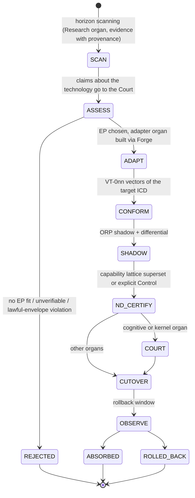

## 28. 2040 Technology Absorption Mechanism

### 28.1 Επιχείρημα επάρκειας πυρήνα

Ο πυρήνας γνωρίζει μόνο **οκτώ ουσίες**: γεγονότα, content addresses, algorithm-tagged κλειδιά, capabilities, controls, συνταγματικά κατηγορήματα, χρόνο, χώρο/πόρους. Καμία από αυτές δεν εξαρτάται από συγκεκριμένο μοντέλο, γλώσσα, βάση, πάροχο, hardware ή κρυπτογραφικό αλγόριθμο. Άρα μια μελλοντική τεχνολογία αλλάζει ένα όργανο ή έναν adapter, **ποτέ** τον πυρήνα. Αυτή είναι η δομική μορφή του T8. Το μετρήσιμο κριτήριό του είναι μηδενικό diff στα ICD-01…ICD-12 εκτός συνταγματικής αναθεώρησης.

### 28.2 Extension points

| EP | Συμβόλαιο | Τι εισέρχεται εδώ (κλάσεις, όχι προβλέψεις) | Τι προστατεύει την ταυτότητα |
|---|---|---|---|
| EP-01 Model Contract | ICD-22 | Νέες αρχιτεκτονικές μοντέλων, reasoning-verified μοντέλα, on-device μοντέλα, πολυτροπικά μοντέλα | KT-01, Battery (INV-I05), receipts (INV-C08), η μία πόρτα (INV-C03) |
| EP-02 Organ ABI | ICD-10 | Νέες εκδόσεις component model/WIT, μελλοντικά ABIs, capability hardware | Conformance VT-010, INV-O01 |
| EP-03 Substrate Adapter | ICD-10, ICD-11 | Νέοι επιταχυντές, neuromorphic, photonic, κβαντικοί συνεπεξεργαστές για ειδικούς αλγορίθμους, αρχειακά μέσα μακράς διάρκειας | Deterministic replay (INV-C08), ORP |
| EP-04 Crypto Suite Registry | ICD-03 | Post-quantum σουίτες, νέα πρότυπα, threshold σχήματα (μόνο μεταξύ συσκευών του κυρίαρχου, KL-7) | INV-X01, INV-X02, KT-09 |
| EP-05 Storage Engine Adapter | ICD-01, ICD-02, ICD-17 | Νέες μηχανές/μέσα αποθήκευσης | Rebuild από ledger (INV-E01), KT-03 |
| EP-06 Transport Adapter | ICD-09 | Νέα messaging, delay-tolerant δικτύωση | Μεταφορά ≠ αλήθεια (ADR-0014) |
| EP-07 Knowledge Format Adapter | ICD-17, ICD-18 | Διάδοχοι ELI/Akoma Ntoso, κανονιστικές γλώσσες κανόνων, επιστημονικά πρότυπα | SHACL migrations, INV-E03 |
| EP-08 Human Interface Modality | ICD-23 | Φωνή, AR/VR, BCI (υπό controls συναίνεσης) | INV-C02, INV-L02 |
| EP-09 Future Human Continuity Port | ICD-25 | Συναινετική σύνδεση ανθρώπου–AEO | Συναίνεση ως Control Record, καμία μεταφορά προσωπικότητας |
| EP-10 Domain Institution Template | ICD-15 | Νέα επιστημονικά/επαγγελματικά domains | KT-12, 0 αλλαγές πυρήνα |
| EP-11 Language/Paradigm | ICD-20 | Νέα παραδείγματα προγραμματισμού, verified compilers, AI-native γλώσσες | INV-F01, KT-10 |
| EP-12 Governance Mechanism | ICD-14, ICD-15 | Νέοι μηχανισμοί διαβούλευσης και συναίνεσης | Υπεροχή Tier-0, INV-C05 |

### 28.3 Technology Absorption Protocol (TAP)

Το TAP είναι **προφίλ του `can-adopt`**, όπως και το ORP. Δεν είναι νέο μονοπάτι.

### 28.4 Όταν πρέπει να αλλάξει ο ίδιος ο πυρήνας

Αν μια τεχνολογία απαιτήσει θεμελιωδώς νέα έννοια χρόνου, χώρου ή ταυτότητας (π.χ. διαπλανητικές καθυστερήσεις που αλλάζουν τη σημασία του «τώρα»), η αλλαγή γίνεται **Tier-0 αναθεώρηση** (§19.3). Ακολουθεί **R-C αντικατάσταση του πυρήνα μέσω ORP**, με Continuity Certificate σε επίπεδο πυρήνα (KT-08 στο επίπεδο αυτό). Η ταυτότητα επιβιώνει γιατί ζει στο ledger και στις δεσμεύσεις, που είναι algorithm-tagged και επαναγκυρώσιμες. Δεν ζει στην υλοποίηση του πυρήνα.

### 28.5 Τι δεν ισχυριζόμαστε

Δεν προβλέπουμε ποιες τεχνολογίες θα υπάρχουν το 2040 (τίμια άγνοια). Ισχυριζόμαστε δομικά κάτι στενότερο: για κάθε **κλάση** τεχνολογίας υπάρχει προκαθορισμένο σημείο εισόδου με συμβόλαιο και conformance, και καμία κλάση δεν απαιτεί αλλαγή ταυτότητας ή επανεκκίνηση από μηδενική βάση. Όπου αυτό αποτύχει (28.4), η αποτυχία είναι ορατή, τεκμηριωμένη και διορθώνεται με διαδικασία, όχι σιωπηρά.

### 28.6 Μετρικές απορρόφησης

- Χρόνος SCAN→ABSORBED ανά κλάση.
- Διατήρηση ND (0 αδήλωτες υποβαθμίσεις).
- Diff στα kernel contracts = ∅.
- Απόκλιση Battery εντός ε μετά από κάθε απορρόφηση γνωσιακού οργάνου.
- Ποσοστό απορροφήσεων που έγιναν rollback, με αιτιολόγηση.
