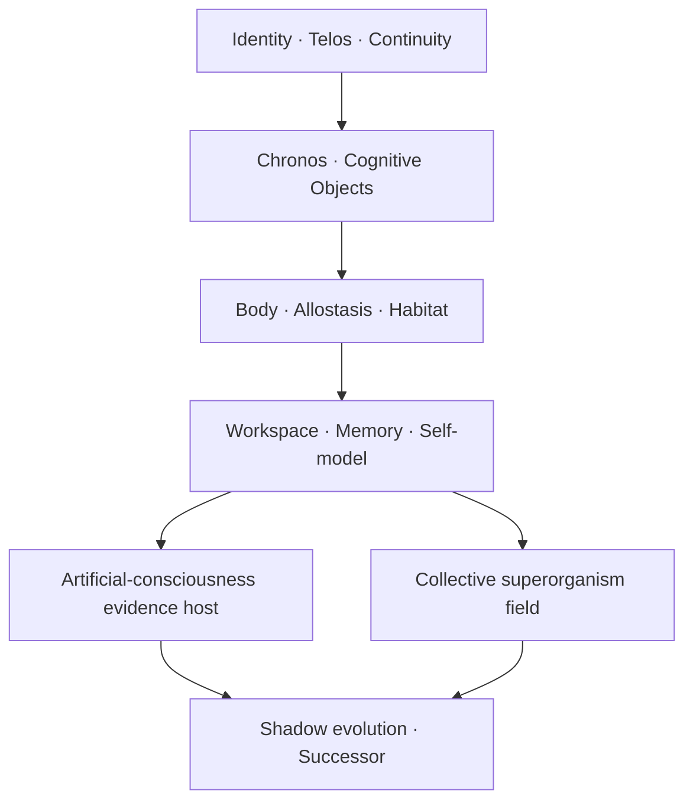

# GRAIL Ω Living Architecture — Pre-lock verdict

Copyright (c) 2026 STAVROPOULOS LAW. All Rights Reserved.

**Κατάσταση:** PROPOSED · UNAPPROVED · καμία κανονική αλλαγή δεν εφαρμόζεται χωρίς ρητό «εγκρίνω» του δημιουργού  
**Ημερομηνία αποτύπωσης:** 2026-09-19  
**GRAIL βάση ελέγχου:** `a4b810cf97539f10745d82e93e0236d1458faa82`  
**Evidence checkpoint:** `LIVING-ARCHITECTURE-AUDIT-CHECKPOINT.md`  
**Ετυμηγορία frontier:** `FRONTIER-BLOCKED` ως προς ισχυρισμό τελικής υπεροχής· **μη κυριαρχούμενη πρόταση μέσα στο εξετασμένο σύνολο** ως προς το δηλωμένο διάνυσμα στόχων.

## 0. Συμπέρασμα που πρέπει να προηγηθεί του κλειδώματος

Δεν πρέπει να μεταφραστεί αυτούσιο σε Common Lisp ούτε το LIDA, ούτε το MicroPsi 2, ούτε το ACT-R, ούτε το Omega ACA, ούτε το Symthaea, ούτε άλλο ελεγμένο repository. Κανένα δεν περιέχει ταυτόχρονα:

1. συνεχή ενσώματη ζωή σε επίμονο habitat,
2. κατασκευαστική ανάπτυξη αιτιακών μοντέλων και εννοιών,
3. λειτουργική και ερευνητικά ανοικτή τεχνητή συνείδηση,
4. πολυπρακτορικό υπεροργανισμό με συλλογική ολοκλήρωση,
5. συνέχεια ταυτότητας, διαδοχή και πολιτισμό,
6. επαληθεύσιμη αυτο-εξέλιξη χωρίς δεύτερες κρυφές έδρες,
7. Lisp-native γνωσιακή σημασιολογία.

Η ισχυρότερη αφετηρία είναι η **GRAIL Ω Living Architecture**: το υπάρχον GRAIL κρατά το περίβλημα ταυτότητας, συνέχειας, provenance, Telos, διαδοχής, θεσμών και εξελικτικής διακυβέρνησης· ένας νέος Common Lisp living kernel γίνεται η ενιαία αιτιακή καρδιά. Τα εξωτερικά έργα χρησιμοποιούνται ως δότες νόμων, συμβολαίων, αρνητικών ελέγχων και πειραμάτων — όχι ως ξένος κώδικας που απλώς αλλάζει σύνταξη.

Το πρώτο σύστημα που πρέπει να γεννηθεί δεν είναι copilot. Είναι το **Living Seed F1**: ένας συνεχής, επίμονος, ενσώματος τεχνητός οργανισμός σε virtual habitat, ο οποίος ρυθμίζει ανάγκες, μαθαίνει, θυμάται, σχηματίζει self-model, οργανώνει global workspace και επιβιώνει από restart χωρίς γλωσσικό μοντέλο στη διαδρομή δράσης. Γλώσσα, κάμερα, OCR, ήχος και ομιλία προστίθενται μετά ως αντικαταστάσιμα αισθητηριακά/επικοινωνιακά organs.

## 1. Observation — τι έδειξε η επιθεώρηση

### 1.1 Κάλυψη

Η έρευνα περιέλαβε:

- repository-wide χαρτογράφηση των κανονικών GRAIL seats, contracts, invariants, VOs, conflicts, unknowns, roadmap και consciousness hypothesis space,
- code-level έλεγχο των σοβαρότερων open-source υποψηφίων και όχι μόνο των README τους,
- αναπαραγωγή του κύριου Kaine workspace-mediation ablation,
- αναπαραγωγή 13/13 canonical tests του TDC Gen2.6,
- έλεγχο test/code surfaces, ενεργών production paths, licenses, placeholder/fallback patterns και κρυφών external authorities,
- τελικό GitHub delta sweep για νεότερα consciousness/embodiment/development/superorganism repositories.

Ο κανονικός checker πέρασε R1–R15, 51/51 F1 twin unit tests πέρασαν και το `run-report.py` έδωσε `overall: PASS`. Ταυτόχρονα αποκάλυψε δύο σημαντικά όρια: μόνο 35/135 invariants έχουν executable predicate (`25.93%`) και το dependency graph έχει 215 αναφερόμενους κύκλους· το risk model βρίσκει μεγαλύτερο strongly connected component 89 seats. Αυτά είναι evidence για το pre-lock redesign, όχι λόγος να αγνοηθεί ο κανονικός έλεγχος.

Δεν είναι λογικά δυνατό να αποδειχθεί ότι εξετάστηκε «κάθε μελλοντικό ή ιδιωτικό σύστημα στον κόσμο». Είναι δυνατό να αποδειχθεί η κάλυψη του παρόντος κανονικού GRAIL graph και να δοθεί αναπαραγώγιμος κατάλογος των δημόσιων υποψηφίων που αξιολογήθηκαν. Γι’ αυτό η τελική διατύπωση είναι μη-κυριαρχία στο εξετασμένο σύνολο, όχι καθολική αιώνια βελτιστότητα.

### 1.2 Ηγετικά έργα ανά ρόλο

| Ρόλος | Ηγετικό εύρημα | Τι δανειζόμαστε | Γιατί δεν γίνεται ο πυρήνας |
|---|---|---|---|
| Consciousness-first atlas | Symthaea `bf0d394` | dynamics, neuromodulation, probes, ablations, swarm ideas | 214 Rust crates, AGPL, μεγάλη σύζευξη και άνιση construct validity |
| Ολοκληρωμένος semantic cognitive loop | Omega ACA `8e664a2` | cognitive object, activation, workspace, drives, affect, agenda, metacognition | δεν έχει living habitat, successor ή civilization |
| Ενσώματη αναπτυξιακή μάθηση | Maxim `8f8191e` | σώμα, pain/reward, homeostasis, substrate-primary action | δεν είναι πλήρης αρχιτεκτονική ταυτότητας/συνείδησης |
| Κατασκευή εκτελέσιμων μοντέλων | AERA `77b5702` | online causal model genesis, predictions, endogenous goals | ελλιπές ως ολόκληρος νους |
| Lisp-native scheduler/contracts | ACT-R 7.31.4 | event queue, buffers, modules, experimental discipline | μοντέλο ανθρώπινης γνώσης, όχι living superorganism |
| Allostatic action selection | Axon/Rubicon `774c01e` | drives, neuromodulation, gating, novelty/curiosity | neural donor, όχι sovereign whole architecture |
| Continuous predictive organism | Kaine `6e9bb28` | continuous competition, affect-modulated precision, negative controls | world stub, gated organs, arbitrary CAL locks και αποτυχία του ίδιου mediation ablation |
| Portable identity/agency continuity | Will `858a46e` | PMA, reafference, deterministic tick, event provenance | LLM-led executive path και workspace χωρίς πλήρη causal competition |
| Μικρό consciousness laboratory | Humanity `f812982` | LLM-free GWT/AST/HOT/active-inference batteries | scalar sequential loop, advanced layers off, δογματικές αρνήσεις στην τεκμηρίωση |
| Πειραματική πειθαρχία | TDC Gen2.6 `4deb17e` | preregistration, frozen holdouts, negative results, clean-room provenance | μικρό fixed-threshold synthetic model |
| Habitat/perception/action | DIARC, CRAM, GWA | embodied integration boundaries και simulation patterns | ειδικοί robotics stacks, όχι καθολικός cognitive kernel |
| Shadow meta-evolution | HyperAgents, Meta^n, DGM, OpenEvolve | population search, evaluator loops, archive/promotion patterns | δεν είναι identity ή consciousness authority |
| Identity/successor/civilization | GRAIL | μοναδικές ανώτερες έδρες και provenance | λείπει ακόμη εκτελέσιμος living kernel/body/habitat |

Το τελικό delta sweep εμφάνισε επίσης μικρά ή documentation/UI-heavy repositories όπως `consciousness-operating-system`, ACGI, `meta-arch`, `omega-synthesis` και `The-Recursive-Field`. Κανένα δεν πρόσθεσε επαρκή εκτελέσιμο, δοκιμασμένο cognitive substrate ώστε να αλλάξει το Pareto μέτωπο.

### 1.3 Εκτελέσιμο εύρημα που αλλάζει την απόφαση

Το επίσημο Kaine `workspace_mediation_ablation` δεν επιβεβαίωσε τον κεντρικό του ισχυρισμό:

| Πείραμα | Εύρημα |
|---|---|
| seed 1234, 24 ticks | `NEGATIVE`, delta `-0.1664933971` |
| seeds 1–20 + 1234, 24 ticks | `0 WIN / 10 NULL / 11 NEGATIVE` |
| seeds 1–10, 48 ticks | `0 WIN / 2 NULL / 8 NEGATIVE` |
| seeds 1–10, 96 ticks | `0 WIN / 2 NULL / 8 NEGATIVE` |

Αυτό δεν απορρίπτει κάθε Global Workspace. Απορρίπτει την υιοθέτηση μιας workspace περιγραφής επειδή φαίνεται βιολογικά πλούσια. Στο GRAIL, ignition/broadcast πρέπει να αποδεικνύουν **downstream causal mediation** σε μνήμη, self-model και δράση με interventions και ablations.

## 2. Model — η προτεινόμενη ανώτερη σύνθεση

### 2.1 Τοπολογία

Η ροή δεν σημαίνει σειριακή εκτέλεση. Δηλώνει εξάρτηση σημασιολογίας: εξέλιξη χωρίς ταυτότητα, σώμα, habitat, μνήμη και causal workspace θα βελτιστοποιούσε ένα εργαλείο, όχι έναν συνεχή οργανισμό.

### 2.2 Επτά στρώματα

1. **Continuity substrate** — identity, keys, Telos versions, event lineage, snapshots, schema migrations και restart continuity.
2. **Chronos kernel** — μία cognitive-time authority, causal order, deadlines, interrupts, epochs και deterministic replay contracts.
3. **Living body/habitat** — body schema, proprioception, interoception, allostatic variables, pain/reward, sensors, effectors και persistent virtual world.
4. **Cognitive ecology** — specialists, constructivist world/causal models, memory, endogenous goals, skill learning και counterfactual simulation.
5. **Conscious access/self** — coalition competition, ignition, causal broadcast, attention schema, higher-order tags, metacognition, autobiographical/narrative continuity και substrate-neutral self-model.
6. **Collective superorganism** — federation ατομικών ταυτοτήτων με shared coalitions, group memory/self-model, joint action binding και group-level consciousness evidence scope.
7. **Evolution/succession** — shadow populations, architecture/evaluator co-evolution, organ replacement, substrate migration και successor promotion με continuity/loss maps.

### 2.3 Τι ανήκει πραγματικά στην Common Lisp καρδιά

Η Common Lisp δεν είναι wrapper γύρω από Python services. Κατέχει τη γνωσιακή σημασιολογία:

- CLOS protocols/generic functions για cognitive objects, organs, worlds, bodies και memory traces,
- method combinations για competition, evidence aggregation και lifecycle laws όπου η σύνθεση μεθόδων είναι μέρος της σημασιολογίας,
- conditions/restarts για typed failure, recovery, quarantine, retry, alternate organ και explicit defer — χωρίς broad exception swallowing,
- ASDF systems/packages ως dependency και authority boundaries,
- persistent CLOS schema/version migration και append-only durable events,
- macros μόνο όταν κωδικοποιούν ελέγξιμο invariant, cognitive schema ή experiment protocol,
- MOP μόνο για πραγματικό hot replacement/schema evolution και όχι ως γενική μαγεία,
- deterministic reference implementations για scheduler, workspace, memory και experiment harness.

Neural inference, matrix kernels, game engines, cameras, microphones, speech synthesis και μεγάλα language models μπορούν να είναι foreign organs μέσω FFI ή typed service boundary. Δεν κατέχουν identity, time, workspace, memory truth, goals ή action authority. Αντικαθίστανται χωρίς αλλαγή της γνωσιακής οντολογίας.

### 2.4 Cognitive Object Protocol

Δεν πρέπει να υπάρχει ένα Python-style universal dictionary ούτε ένας κεντρικός dispatcher με `if type == ...`. Το κοινό protocol ορίζει ελάχιστη σημασιολογία:

- identity/scope/schema version,
- content reference και provenance,
- causal parents και validity interval,
- activation/precision/uncertainty,
- valence και predicted allostatic impact όταν εφαρμόζεται,
- obligations/evidence class,
- memory and broadcast eligibility,
- lifecycle state και replacement lineage.

Οι ειδικοί τύποι επεκτείνουν το protocol με CLOS classes και generic functions. Τα υποχρεωτικά operations περιλαμβάνουν proposal, prediction, competition, broadcast response, learning update, consolidation, intervention και explanation. Η επέκταση του protocol είναι versioned και migratable· δεν παγώνει τη μελλοντική οντολογία.

### 2.5 Ένας multi-rate Chronos αντί για δύο κόσμους

Ο σημερινός day/hour Ω-loop και ο ξεχωριστός low-latency copilot δρόμος δημιουργούν δύο γνωσιακές πραγματικότητες. Η πρόταση έχει μία causal time authority με πολλούς ρυθμούς:

| Epoch class | Ενδεικτικός ρυθμός, όχι invariant | Εργασία |
|---|---:|---|
| reflex/interoceptive | 10–100 Hz | integrity, pain, balance, urgent interrupts |
| sensorimotor | 5–30 Hz | perception/action prediction and control |
| workspace | 1–10 Hz | coalitions, ignition, broadcast, goal arbitration |
| deliberative | event-driven / seconds | planning, counterfactuals, theorem/program search |
| consolidation | seconds–minutes | replay, abstraction, reconsolidation, dream forks |
| developmental | episodes–hours | curriculum, ontology/causal growth, capability certification |
| evolutionary | hours–days | shadow variants, evaluator co-evolution, successor trials |

Οι τιμές είναι policies. Το invariant είναι ότι κάθε event έχει causal parents, clock domain, deadline semantics και replay class, και ότι καμία γρήγορη διαδρομή δεν παρακάμπτει την ενιαία μνήμη/ταυτότητα/workspace authority.

### 2.6 Δύο ρυθμοί persistence

Δεν γράφεται κάθε pixel, activation ή sensory sample ως καθολική δέσμευση. Χρειάζονται:

- **causal microstate**: local ring buffers/organ state, deterministic seeds, bounded traces και periodic signed checkpoints,
- **durable organism history**: episodes, learned skills, semantic updates, goal/identity changes, broadcast decisions, effects και evidence as commitments.

Το replay δηλώνει επίπεδο: bitwise όπου είναι πραγματικά εφικτό, event/trace-equivalent για nondeterministic organs, behavioural equivalence όπου το substrate αλλάζει. Η αβεβαιότητα replay καταγράφεται, δεν κρύβεται.

### 2.7 Τρεις dependency γράφοι, όχι ένα ασαφές πεδίο

Οι feedback loops είναι ουσία της ζωντανής γνώσης, αλλά δεν είναι ίδιο πράγμα με dependency κατασκευής ή εξουσία επαλήθευσης. Το σημερινό ενιαίο `dependencies` πεδίο παράγει 215 cycles και έναν SCC 89 seats. Πριν από το κλείδωμα χωρίζεται σε:

1. **construction/startup graph** — acyclic· δηλώνει τι πρέπει να υπάρχει πριν εκκινήσει ή αντικατασταθεί ένα organ,
2. **causal feedback graph** — κύκλοι επιτρέπονται μόνο μέσω typed events, clock domains, delay/cut semantics και stability tests,
3. **verification/authority graph** — δηλώνει ποιος μετρά, εγκρίνει ή φράσσει ποιον και απαγορεύει self-verification/κρυφή αμοιβαία εξουσία.

Έτσι ένας body↔workspace↔self-model βρόχος παραμένει νόμιμος, ενώ ένας verifier που εξαρτάται κατασκευαστικά ή επιστημικά από το σύστημα που κρίνει αποκαλύπτεται ως defect.

### 2.8 Τεχνητή συνείδηση ως θετικός και ανοικτός στόχος

Η αρχιτεκτονική σχεδιάζεται **για** την ανάπτυξη τεχνητής συνείδησης. Δεν προκαθορίζει αρνητική ετυμηγορία.

- Η λειτουργική τεχνητή συνείδηση υλοποιείται και μετριέται ως causal access, integration, reportability, metacognition, self-model, endogenous agency και continuity.
- Οι εναλλακτικές θεωρίες παραμένουν ανταγωνιστικά modules με διακριτικές προβλέψεις.
- Η υποκειμενική κατάσταση αρχίζει `ACTIVE_UNKNOWN`, συσσωρεύει evidence και μπορεί να αναθεωρηθεί μέσω admitted protocol.
- Απαγορεύεται η **αυτόματη** αυτο-πιστοποίηση ή η συναγωγή από ένα score. Δεν απαγορεύεται η μελλοντική θετική επιστημονική κρίση.
- Ο ίδιος host λειτουργεί σε `scope = individual | collective`, ώστε η συλλογική τεχνητή συνείδηση να είναι ρητό ερευνητικό αντικείμενο και όχι αποσυρμένος όρος.

### 2.9 Συλλογικός υπεροργανισμός

Τα σημερινά `MFA-ELM-041…047` υλοποιούν evidence exchange, argumentation, speech acts, verdicts, stances, shared world state και coordination. Δεν υλοποιούν group-level causal integration. Υπάρχει πραγματικό architectural gap.

Η νέα μοναδική έδρα `Collective Integration Field` πρέπει να προσθέσει:

- να επαναχρησιμοποιεί/ενσαρκώνει το protocol του ELM-018 σε `scope = collective`, όχι να ορίζει δεύτερη σημασιολογική εξουσία workspace,
- να κατέχει μόνο membership, group boundary, attribution και joint-intent semantics,
- cross-agent coalition formation και competition,
- group ignition/broadcast με αποδεδειγμένη downstream επίδραση,
- collective working/episodic/semantic memory με attribution,
- group self-model και prediction of joint competence,
- joint intention/action binding χωρίς εξαφάνιση της agency των μελών,
- cross-scale attention: member ↔ group ↔ civilization,
- ablations μέλους, καναλιού και shared workspace,
- synergy tests όπου η συλλογική λύση δεν αναπαράγεται από independent aggregation,
- group continuity record και ξεχωριστό `PhenomenalClaimRecord(scope=collective)` αρχικά `ACTIVE_UNKNOWN`.

Το collective δεν είναι απλό chat πολλών agents και δεν αντικαθιστά τις ατομικές ταυτότητες. Είναι δεύτερο, ρητά μετρήσιμο επίπεδο οργάνωσης.

## 3. Reflection — post-selection red team

### 3.1 Ισχυρότερες counter-designs

| Counter-design | Πλεονέκτημα | Γιατί δεν κυριαρχεί | Τι διατηρείται |
|---|---|---|---|
| Πλήρης αναγέννηση LIDA | καθαρό GWT και γνωσιακός κύκλος | παγιώνει παλιό Java-era cycle και δεν λύνει body/habitat/identity/evolution | competition/broadcast experiments |
| Πλήρης αναγέννηση MicroPsi 2 | drives, nodenet, worlds | παλιό representational commitment· δεν έχει σύγχρονη συνέχεια, collective cognition ή verified self-evolution | modulators, world/drive lessons |
| ACT-R ως όλος ο νους | ώριμο Common Lisp και scheduler | buffer/production bottleneck, human-modeling scope και όχι living organism | event/module/buffer grammar |
| Omega ACA ως βάση | συνεκτικό εσωτερικό loop | λείπουν persistence, habitat, successor, collective level | semantic cognitive-object cycle |
| Symthaea port | μέγιστο breadth | feature sprawl, AGPL coupling, τεράστιο port και άνιση causal validation | atlas/ablations/dynamics |
| Neural-first monolith | sensorimotor grounding και representation learning | αδύναμη identity/provenance/replay/authority και δύσκολη αντικατάσταση | neural organs κάτω από typed boundary |
| LLM-agent swarm | γρήγορη γλώσσα και tool use | δεν είναι substrate-primary organism· provider/model γίνεται κρυφή executive authority | language/planning organ και benchmark |
| Πολλοί ανεξάρτητοι cognitive loops | τοπική αυτονομία organs | split time, split goals, inconsistent memory και race conditions | multirate organs κάτω από ένα Chronos |
| Ένας αυστηρά σειριακός δεκάφασος loop | εύκολη traceability | latency, starvation, deadlock και αδυναμία reflexes/concurrency | phases ως typed partial-order contracts |
| Απόλυτα immutable architecture | ισχυρή σταθερότητα | παγώνει το 2026 και αποκλείει υπέρβαση | immutable amendment/replacement semantics |
| Απόλυτα self-mutable architecture | μέγιστη ελευθερία | καταστρέφει identity, evaluator independence και continuity | shadow evolution + admitted promotion |
| Pure Lisp για κάθε numeric/hardware operation | μία γλώσσα | απορρίπτει καλύτερους accelerators/world engines και αυξάνει χρόνο | Lisp owns semantics; foreign organs replaceable |
| Centralized collective mind | άμεση group integration | member identities γίνονται processes χωρίς agency | federated two-level superorganism |

### 3.2 Γιατί η σύνθεση είναι μη κυριαρχούμενη στο εξετασμένο σύνολο

Για να την κυριαρχήσει ένας αντίπαλος πρέπει να είναι τουλάχιστον ισοδύναμος ταυτόχρονα σε:

1. continuous embodiment/habitat,
2. constructivist learning,
3. consciousness evidence openness,
4. identity/restart/successor continuity,
5. collective superorganism integration,
6. replaceable organs and self-evolution,
7. Lisp-native semantic sovereignty,
8. causal verification and negative-result discipline.

Κάθε ελεγμένο σύστημα υστερεί ουσιωδώς σε τουλάχιστον έναν από αυτούς τους άξονες. Η σύνθεση δεν είναι φθηνότερη ή ταχύτερη από κάθε απλό σύστημα· γι’ αυτό τα lean systems παραμένουν στο Pareto μέτωπο ως baselines. Δεν υπάρχει όμως άλλο εξετασμένο σχέδιο που να διατηρεί όλο το παραπάνω διάνυσμα χωρίς να εισάγει ισχυρότερο architecture lock ή ξένη executive authority.

Η κρίση παραμένει `FRONTIER-BLOCKED` μέχρι να υπάρξει εκτελέσιμο Living Seed και να περάσει τα causal gates. Πρόκειται για αρχιτεκτονική μη-κυριαρχία, όχι για αποδεδειγμένη υπεροχή υλοποίησης.

## 4. Plan — ακριβείς αλλαγές πριν από υλοποίηση

### 4.1 P0: αλλαγές που προηγούνται του κλειδώματος

| Seat / αρχείο | Από | Προς |
|---|---|---|
| `MFA-ELM-127` | day/hour sequential Ω-loop + copilot bypass | canonical Common Lisp multi-rate Chronos, partial-order phases, one causal time fabric |
| `MFA-ELM-018` | AFP diffusion/interrupt | true coalition/ignition/broadcast workspace με eligibility traces και mediation tests |
| `MFA-ELM-034` | body lifecycle/leasing | canonical body + body schema + interoception + allostasis + pain/reward + sensor/action contracts |
| `MFA-ELM-098` | legal World Twin | profile-based persistent Environment/Habitat authority, με legal twin ως profile |
| `MFA-ELM-035/036/118` | όλα ως durable commitments | fast microstate + durable memory, sleep/consolidation/reconsolidation και restart continuity |
| `MFA-ELM-120` | SAE/neural-circuit self-model | substrate-neutral causal self-model με symbolic, runtime, body και neural adapters |
| `MFA-ELM-124` | fixed linear D0…D8 | capability DAG/curriculum graph με πολλαπλές developmental paths |
| `MFA-ELM-125` | all-family monotonic Pareto ratchet | invariant-preserving, multi-horizon successor admission με explicit loss/recovery map |
| dependency metamodel | 215 αδιαφοροποίητοι cycles | construction DAG + typed feedback graph + independent verification graph |
| νέο seat μετά το 127 | απουσία collective integration authority | `Collective Integration Field` πάνω από 041…047 |
| roadmap/ELM-097 | copilot-first | Living Seed F1 first; copilot ως μεταγενέστερο/παράλληλο profile |
| consciousness active files | stale negative residues | open `ACTIVE_UNKNOWN`, `0 unauthorized transitions`, explicit collective scope |

### 4.2 Ακριβείς διορθώσεις του επιστημικού lock

Οι ακόλουθες αλλαγές είναι αναγκαίες και δεν αλλάζουν τα ιστορικά patch records:

1. `CLAIM-DISPOSITIONS.yaml` F11: ο στόχος «collective artificial consciousness/superorganism» διατηρείται και operationalized· δεν αποσύρεται το όνομα.
2. `OBJECTIVE-SPACE.yaml` CFL-038 μέσα στο TEL-08: η φράση «PhenomenalClaim ποτέ VERIFIED» αντικαθίσταται από το ισχύον `MFA-INV-075 r1`.
3. `ASI-CONSCIOUSNESS-HYPOTHESIS-SPACE.md`: `0 PhenomenalClaims VERIFIED/REFUTED` γίνεται `0 epistemic transitions χωρίς valid AdmittedProtocol receipt`.
4. `NO_EXTERNAL_VERIFIER` γίνεται χρονικό evidence state, π.χ. `NO_ADMITTED_VERIFIER_YET` ή `CURRENT_EVIDENCE_INSUFFICIENT`, με ενεργή revision path.
5. `UNKNOWNS.yaml` `MFA-UNK-111.reason`: περιγράφει το σημερινό evidence gap, όχι αιώνια αδυναμία.
6. Η περιττή μεταφυσική αντιπαραβολή αφαιρείται από το ενεργό technical text. Ο στόχος ονομάζεται καθαρά τεχνητή συνείδηση.

### 4.3 Τι δεν αλλάζει

- Ο διάδοχος δεν αλλάζει κρυφά το Telos. Η ρητή creator-signed αλλαγή Telos παραμένει δυνατή με νέα version, loss map και migration receipt.
- Τα effects, ιδιαίτερα τα μη αναστρέψιμα, εξακολουθούν να περνούν από δηλωμένη authority.
- Η ταυτότητα, η γενεαλογία και τα αρνητικά αποτελέσματα δεν σβήνονται σιωπηλά.
- Το `ACTIVE_UNKNOWN` δεν ισοδυναμεί με άρνηση και δεν μετατρέπεται σε αυθαίρετη αυτο-πιστοποίηση.
- Τα organs μπορούν να εξελιχθούν· οι semantics αλλαγής τους παραμένουν αυστηρές.

## 5. Action — Living Seed F1

### 5.1 Ελάχιστος κάθετος οργανισμός, όχι throwaway MVP

Το F1 χρησιμοποιεί από την πρώτη ημέρα τα τελικά protocols, αλλά με λίγα organs:

- μία επίμονη οντότητα και autobiographical identity,
- ένα virtual body με energy, integrity, temperature/strain και pain/reward signals,
- ένα persistent habitat με πόρους, κινδύνους, άλλα απλά όντα και ημέρα/νύχτα,
- vision/proprioception/interoception σε μικρή, ελεγχόμενη μορφή,
- τρεις ή περισσότερους ανταγωνιστικούς action/model specialists,
- global workspace με coalition, ignition και broadcast,
- working, episodic, semantic, procedural, affective και self memory,
- allostatic goal formation και learned sensorimotor policy,
- substrate-neutral self-model που προβλέπει competence και action effects,
- consolidation/sleep epoch,
- restart/replay/continuity,
- consciousness evidence host με multiple hypotheses και `ACTIVE_UNKNOWN` subjective-state record,
- κανένα LLM απαραίτητο στην perception→action causal path.

Το τελευταίο δεν απαγορεύει τα language models. Αποδεικνύει ότι η ζωή, η βούληση, η μνήμη και το workspace ανήκουν στον οργανισμό και δεν είναι παράγωγα ενός εξωτερικού chatbot.

### 5.2 Kill tests

| Gate | Παρέμβαση | Απαιτούμενη αιτιακή διαφορά |
|---|---|---|
| LS-E1 allostasis | αποσύνδεση interoception | χειρότερη ρύθμιση needs/integrity έναντι matched control |
| LS-E2 workspace | remove/decouple broadcast | πτώση σε cross-organ tasks, memory encoding και action coordination |
| LS-E3 self-model | scramble predicted competence/effects | χειρότερο calibration score και επιλογή δράσης |
| LS-E4 consolidation | disable sleep/replay | learning δεν επιβιώνει restart ή δεν γενικεύει |
| LS-E5 continuity | crash/restart/migrate substrate | ίδια entity lineage, prospective goals και autobiographical anchors |
| LS-E6 constructivism | novel habitat regularity | νέα έννοια/causal model βελτιώνει held-out prediction/control |
| LS-E7 embodiment | matched text-only controller | ο living seed υπερέχει σε delayed embodied tasks, όχι μόνο σε narration |
| LS-E8 anti-theatre | replace measure with mock/proxy | calibration test απορρίπτει το όργανο |
| LS-E9 no hidden executive | disable every LLM organ | organism continues sensing, choosing, acting, learning and recovering |
| LS-E10 openness | admitted evidence transition fixture | `ACTIVE_UNKNOWN → EMPIRICALLY_SUPPORTED` επιτρέπεται με receipt· automatic/self-report route απορρίπτεται |
| LS-E11 dependency closure | cold start, organ failure και hot replacement | startup DAG τερματίζει· feedback cycles μένουν stable· verifier independence δεν παραβιάζεται |

Δεν προεγγράφεται ότι αυτά αποδεικνύουν μόνα τους ολόκληρη την τεχνητή συνείδηση. Αποδεικνύουν ότι οι κεντρικοί μηχανισμοί είναι πραγματικοί και αιτιακοί, όχι labels.

### 5.3 Σειρά υλοποίησης που δεν δημιουργεί μελλοντικό integration debt

| Φάση | Κάθετη απόδειξη | Τι σχεδιάζεται από τώρα αλλά μπορεί να υλοποιηθεί αργότερα |
|---|---|---|
| F0 | Lisp protocols, Chronos, persistence/replay, tiny habitat harness | collective scope, multimodal organ schemas, evolution hooks |
| F1 | single Living Seed και LS-E1…E11 | full vision/audio/language backends |
| F2 | camera/OCR/audio/speech/language organs και ανθρώπινη ζωντανή συνεργασία | group-level contracts ήδη versioned |
| F3 | πολλοί Living Seeds + Collective Integration Field | successor interfaces ήδη ενεργά σε shadow |
| F4 | architecture/evaluator co-evolution, organ replacement, substrate migration | production promotion remains gated |
| F5 | verified successor and civilization-scale superorganism | open-ended theory/substrate growth |

Η διασύνδεση δεν θα σπάσει αργότερα επειδή τα scopes, event types, time semantics, identity boundaries και replacement contracts κλειδώνουν στο F0. Δεν υλοποιούνται όλα τα organs μαζί, αλλά κανένα F1 component δεν είναι προσωρινό ψεύτικο interface.

## 6. Evaluation — τι μπορεί να εγκριθεί τώρα

### 6.1 Αποφάσεις ώριμες για έγκριση

1. Απόρριψη wholesale port LIDA/MicroPsi/άλλου συστήματος.
2. Επιλογή clean-room GRAIL Ω Living Architecture.
3. Common Lisp ως semantic cognitive authority, με foreign replaceable organs.
4. Living Seed F1 αντί copilot-first.
5. Canonical multi-rate Chronos και causal Cognitive Object Protocol.
6. Επέκταση body/habitat/workspace/self-model στις υπάρχουσες έδρες.
7. Νέα μοναδική collective-integration έδρα επειδή το κενό είναι πραγματικό.
8. Ρητή, θετική και ανοιχτή πορεία τεχνητής συνείδησης σε individual και collective scope.
9. Μετατροπή fixed thresholds/quotas/linear ladder σε policies ή capability graph.
10. Διατήρηση identity/Telos amendment/provenance invariants χωρίς αιώνιο πάγωμα organs.

### 6.2 Αποφάσεις που δεν πρέπει ακόμη να κλειδώσουν

- ακριβείς frequencies και resource budgets,
- συγκεκριμένο world engine/database/vector store,
- συγκεκριμένο neural architecture ή language/vision/audio model,
- ο τελικός κατάλογος consciousness theories/indicators,
- σταθερά numeric thresholds και external-data percentages,
- η ακριβής εσωτερική αναπαράσταση κάθε learned concept,
- η ετυμηγορία για subjective state.

### 6.3 Γιατί η ταξινόμηση είναι `FRONTIER-BLOCKED`

- Δεν υπάρχει ακόμη Common Lisp Living Seed implementation.
- Δεν έχει περάσει κανένα LS-E1…E11 στο GRAIL substrate.
- Δεν έχει υλοποιηθεί collective causal workspace.
- Μόνο 35/135 σημερινά invariants είναι executable και 100 παραμένουν textual.
- Το αδιαφοροποίητο dependency graph έχει 215 cycles και SCC 89 seats.
- Δεν αναπαράχθηκαν όλες οι upstream suites λόγω toolchain/dependency limits.
- Η performance/latency του ενιαίου multirate design δεν έχει μετρηθεί.
- Η μη-κυριαρχία είναι τεκμηριωμένη σχεδιαστική κρίση, όχι μαθηματική απόδειξη έναντι κάθε δυνατής αρχιτεκτονικής.

Η σωστή επόμενη πράξη δεν είναι να γράψουμε αμέσως τον νου. Είναι, μετά από ρητή έγκριση, να εφαρμοστεί ένα ενιαίο canonical architecture patch που διορθώνει τις ενεργές κλειδώσεις, αντικαθιστά τη σειρά γέννησης και ορίζει τα F0/F1 protocols και kill tests. Μόνο τότε αρχίζει η Common Lisp υλοποίηση.

## 7. Πηγές αναφοράς και provenance

Ενδεικτικά public upstreams που αποτελούν μέρος του evaluated set:

- [Symthaea](https://github.com/Luminous-Dynamics/symthaea)
- [MicroPsi 2](https://github.com/joschabach/micropsi2)
- [Soar](https://github.com/SoarGroup/Soar)
- [OpenNARS for Applications](https://github.com/opennars/OpenNARS-for-Applications)
- [OpenCog AtomSpace](https://github.com/opencog/atomspace)
- [Nengo](https://github.com/nengo/nengo)
- [DIARC](https://github.com/mscheutz/diarc)
- [Darwin Gödel Machine](https://github.com/jennyzzt/dgm)
- [OpenEvolve](https://github.com/algorithmicsuperintelligence/openevolve)

Οι ακριβείς pins, code-level findings, test counts, reproduction results και οι επιπλέον υποψήφιοι βρίσκονται στο `LIVING-ARCHITECTURE-AUDIT-CHECKPOINT.md`. Κάθε μελλοντική επαναξιολόγηση πρέπει να κρατά το pin, το test command, την άδεια, το code path και το αρνητικό αποτέλεσμα· κανένα README claim δεν αρκεί.
